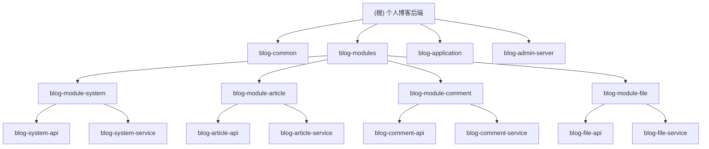

# 个人博客后端系统

## 项目愿景
构建一个高性能、易扩展的个人博客后端系统，提供文章管理、用户认证、评论互动、文件上传等核心功能，支持多用户博客平台的建设。

## 架构总览

本项目采用**Spring Boot 3.5.5 + Maven多模块**架构，遵循领域驱动设计(DDD)原则，实现业务模块的高内聚低耦合。

### 模块结构图


## 模块索引

| 模块路径 | 职责描述 | 技术栈 |
|---------|---------|--------|
| [blog-common](./blog-common/CLAUDE.md) | 公共基础模块，包含工具类、常量、异常处理等 | Java 21, Lombok |
| [blog-application](./blog-application/CLAUDE.md) | 主应用启动模块，配置管理和依赖注入 | Spring Boot 3.5.5, Spring Web |
| [blog-admin-server](./blog-admin-server/CLAUDE.md) | Spring Boot Admin 服务端，用于监控其他 Spring Boot 应用 | Spring Boot Admin |
| [blog-modules/CLAUDE.md](./blog-modules/CLAUDE.md) | 所有业务领域模块的聚合器，本身不包含业务逻辑 | Maven |
| [blog-system-api](./blog-modules/blog-module-system/blog-system-api/CLAUDE.md) | 系统模块API接口层，用户认证和权限管理 | Spring Web, Spring Security |
| [blog-system-service](./blog-modules/blog-module-system/blog-system-service/CLAUDE.md) | 系统模块服务层，用户和权限业务逻辑 | Spring Data JPA, MyBatis-Plus |
| [blog-article-api](./blog-modules/blog-module-article/blog-article-api/CLAUDE.md) | 文章模块API接口层，文章CRUD操作 | Spring Web, RESTful API |
| [blog-article-service](./blog-modules/blog-module-article/blog-article-service/CLAUDE.md) | 文章模块服务层，文章业务逻辑处理 | Spring Data JPA, MyBatis-Plus |
| [blog-comment-api](./blog-modules/blog-module-comment/blog-comment-api/CLAUDE.md) | 评论模块API接口层，评论管理接口 | Spring Web, RESTful API |
| [blog-comment-service](./blog-modules/blog-module-comment/blog-comment-service/CLAUDE.md) | 评论模块服务层，评论业务逻辑处理 | Spring Data JPA, MyBatis-Plus |
| [blog-file-api](./blog-modules/blog-module-file/blog-file-api/CLAUDE.md) | 文件模块API接口层，文件上传下载接口 | Spring Web, File Handling |
| [blog-file-service](./blog-modules/blog-module-file/blog-file-service/CLAUDE.md) | 文件模块服务层，文件存储和管理逻辑 | Spring Data JPA, File Storage |

## 运行与开发

### 环境要求
- JDK 21+
- Maven 3.6+
- MySQL 8.0+

### 快速启动
```bash
# 克隆项目
git clone <repository-url>
cd personal-blog-backend

# 编译项目
mvn clean compile

# 运行应用
mvn spring-boot:run -pl blog-application
```

### 开发规范
1. **代码风格**: 遵循Google Java代码风格
2. **分支策略**: Git Flow工作流
3. **提交信息**: 使用约定式提交(Conventional Commits)
4. **API设计**: RESTful风格，资源命名使用复数形式

## 测试策略

### 测试金字塔
- **单元测试**: 覆盖核心业务逻辑，使用JUnit 5 + Mockito
- **集成测试**: 验证模块间集成，使用Spring Boot Test
- **API测试**: 使用RestAssured进行接口测试
- **性能测试**: 使用JMeter进行压力测试

### 测试覆盖率目标
- 单元测试覆盖率 ≥ 80%
- 集成测试覆盖率 ≥ 60%
- API测试覆盖率 ≥ 90%

## 编码规范

### 代码组织
1. **包结构**: 按功能模块划分，避免循环依赖
2. **命名约定**:
   - 类名: 大驼峰命名法
   - 方法名: 小驼峰命名法
   - 常量: 全大写，下划线分隔
3. **注释要求**: 公共方法和复杂逻辑必须添加注释

### 异常处理
1. 使用自定义业务异常
2. 统一异常处理机制
3. 友好的错误信息返回

## AI 使用指引

### 推荐使用场景
1. **代码生成**: 实体类、DTO、Mapper接口的生成
2. **文档编写**: API文档、技术文档的辅助编写
3. **代码审查**: 代码质量检查和优化建议
4. **测试用例**: 单元测试和集成测试的生成

### 注意事项
1. 生成的代码需要人工审查和测试
2. 确保符合项目的架构规范和代码风格
3. 敏感配置信息不应通过AI处理

## 变更记录 (Changelog)

### 2025-11-09
- 架构师完成项目扫描，更新根级架构文档与模块索引。
- 发现并添加 `blog-admin-server` 模块到架构总览和模块索引。
- 更新 `blog-modules` 聚合模块的描述和链接。

### 2025-09-19
- 创建根级架构文档
- 添加Mermaid模块结构图
- 建立模块索引和开发规范
- 初始化AI使用指引
