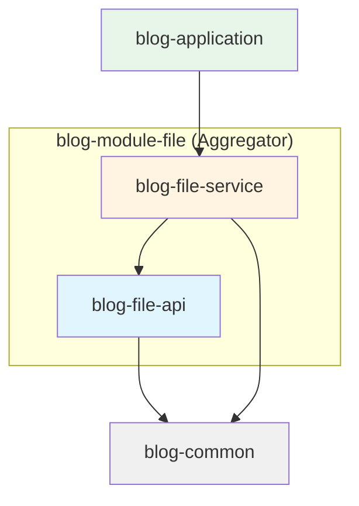
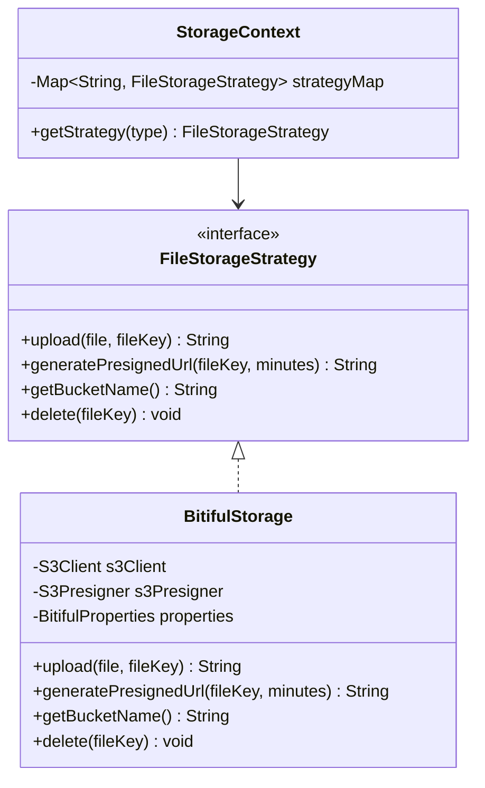
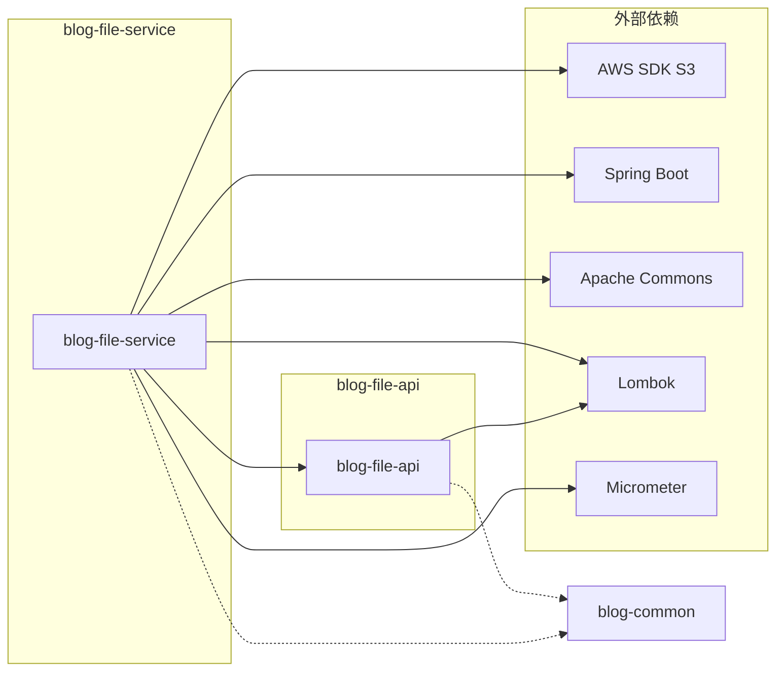
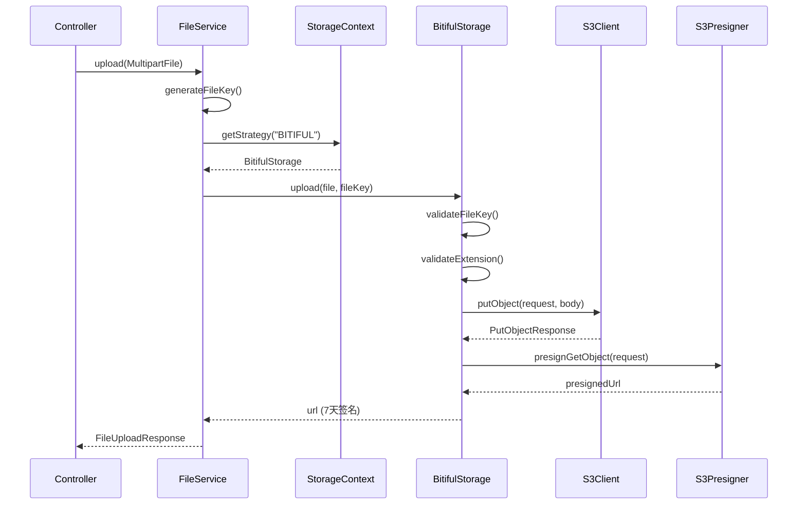
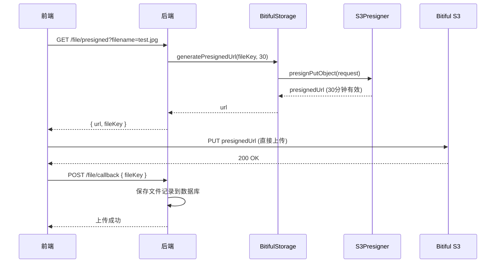
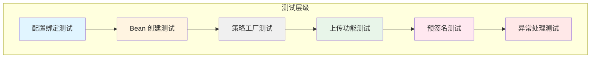

# 📦 blog-module-file 模块代码理解文档

## 概述

`blog-module-file` 是博客系统中负责**文件存储与管理**的独立模块，采用模块化设计和策略模式，支持多种云存储服务（当前实现 Bitiful S3 兼容存储）。

---

## 📐 模块架构

### 目录结构

```
blog-module-file/
├── pom.xml                              # 聚合器 POM
├── blog-file-api/                       # API 层（接口定义）
│   ├── pom.xml
│   └── src/main/java/com/blog/enums/
│       └── FileErrorCode.java           # 文件错误码枚举
└── blog-file-service/                   # Service 层（实现）
    ├── pom.xml
    └── src/main/java/com/blog/infrastructure/
        ├── config/
        │   ├── BitifulConfig.java       # S3 客户端配置
        │   └── BitifulProperties.java   # 配置属性绑定
        ├── oss/
        │   └── BitifulStorage.java      # Bitiful 存储实现
        └── storage/
            ├── FileStorageStrategy.java # 存储策略接口
            └── StorageContext.java      # 策略上下文（工厂）
```

### 模块关系图



---

## 🔍 核心组件详解

### 1. FileErrorCode（错误码枚举）

#### 📄 文件路径
[FileErrorCode.java](file:///Users/liusx/CodeRepository/IdeaProjects/personal-blog-backend/blog-modules/blog-module-file/blog-file-api/src/main/java/com/blog/enums/FileErrorCode.java)

#### 核心职责
- 定义文件模块的标准化错误码（11000 系列）
- 实现 `ErrorCode` 接口，集成全局异常处理
- 支持通过 `code` 反查枚举实例

#### 错误码设计规范

| 错误码 | 常量名 | 场景说明 |
|--------|--------|----------|
| 11001 | `FILE_UPLOAD_FAILED` | 文件上传失败（IO/网络/SDK 异常） |
| 11002 | `FILE_INVALID_TYPE` | 文件类型不在白名单 |
| 11003 | `FILE_EXCEED_MAX_SIZE` | 文件超过大小限制 |
| 11004 | `FILE_INVALID_NAME` | 文件名无效或包含非法字符 |
| 11005 | `FILE_MD5_EXISTS` | 文件秒传（MD5 已存在） |
| 11006 | `FILE_STORAGE_ERROR` | 第三方存储服务异常 |
| 11007 | `FILE_PRESIGNED_URL_FAILED` | 预签名 URL 生成失败 |
| 11008 | `FILE_NOT_FOUND` | 文件不存在 |
| 11009 | `FILE_DOWNLOAD_FAILED` | 文件下载失败 |
| 11010 | `FILE_DELETE_FAILED` | 文件删除失败 |
| 11011 | `FILE_STORAGE_TYPE_INVALID` | 存储类型配置错误 |
| 11012 | `FILE_BUCKET_NOT_FOUND` | Bucket 不存在或无权限 |
| 11013 | `FILE_PRESIGNED_URL_EXPIRED` | 预签名 URL 已过期 |
| 11014 | `FILE_KEY_GENERATE_FAILED` | 文件路径生成失败 |

#### 关键方法

```java
// 根据错误码反查枚举
public static FileErrorCode fromCode(Integer code) {
    if (code == null) return null;
    for (FileErrorCode item : values()) {
        if (item.getCode().equals(code)) return item;
    }
    return null;
}
```

---

### 2. BitifulProperties（配置属性）

#### 📄 文件路径
[BitifulProperties.java](file:///Users/liusx/CodeRepository/IdeaProjects/personal-blog-backend/blog-modules/blog-module-file/blog-file-service/src/main/java/com/blog/infrastructure/config/BitifulProperties.java)

#### 核心职责
- 绑定 `application.yaml` 中的 `bitiful.*` 配置
- 使用 `@Validated` + `@NotBlank` 强制校验
- 支持微服务通过 ConfigMap/Secret 注入

#### 配置项说明

| 字段 | 类型 | 默认值 | 说明 |
|------|------|--------|------|
| `endpoint` | String | `s3.bitiful.net` | S3 兼容 endpoint |
| `accessKey` | String | *(必填)* | 子账户 Access Key |
| `secretKey` | String | *(必填)* | 子账户 Secret Key |
| `bucket` | String | `blog-files` | Bucket 名称 |
| `region` | String | `cn-east-1` | S3 区域 |

#### 配置示例

```yaml
bitiful:
  endpoint: s3.bitiful.net
  access-key: ${BITIFUL_AK}      # 环境变量注入
  secret-key: ${BITIFUL_SK}
  bucket: blog-module-file
  region: cn-east-1
```

---

### 3. BitifulConfig（S3 客户端配置）

#### 📄 文件路径
[BitifulConfig.java](file:///Users/liusx/CodeRepository/IdeaProjects/personal-blog-backend/blog-modules/blog-module-file/blog-file-service/src/main/java/com/blog/infrastructure/config/BitifulConfig.java)

#### 核心职责
- 创建 `S3Client` 和 `S3Presigner` Bean
- 配置 AWS SDK V2 的 S3 兼容模式
- 集成 Micrometer 监控

#### 设计亮点

> [!IMPORTANT]
> **工厂模式 + 不可变配置**
> - 使用 Guava `ImmutableMap` 封装配置，防止运行时篡改
> - 通过 `@RequiredArgsConstructor` 注入 `BitifulProperties`
> - 单例 Bean，线程安全

#### 关键配置

```java
@Bean
public S3Client bitifulS3Client(MeterRegistry meterRegistry) {
    return S3Client.builder()
        .region(Region.of(properties.getRegion()))
        .endpointOverride(URI.create(properties.getEndpoint()))
        .credentialsProvider(StaticCredentialsProvider.create(
            AwsBasicCredentials.create(
                properties.getAccessKey(),
                properties.getSecretKey()
            )
        ))
        .serviceConfiguration(S3Configuration.builder()
            .chunkedEncodingEnabled(true)       // 支持大文件分片
            .pathStyleAccessEnabled(true)       // Bitiful 必须使用 path-style
            .build())
        .build();
}
```

#### Micrometer 监控集成

```java
meterRegistry.config().commonTags(
    "storage.provider", "bitiful",
    "bucket", properties.getBucket()
);
```

通过 `/actuator/metrics` 可查看 S3 请求指标：
- `s3_client_requests_total{storage.provider="bitiful"}`
- `s3_request_duration_seconds`

---

### 4. FileStorageStrategy（策略接口）

#### 📄 文件路径
[FileStorageStrategy.java](file:///Users/liusx/CodeRepository/IdeaProjects/personal-blog-backend/blog-modules/blog-module-file/blog-file-service/src/main/java/com/blog/infrastructure/storage/FileStorageStrategy.java)

#### 核心职责
- 定义文件存储的统一抽象接口
- 支持策略模式，解耦业务与具体存储实现
- 便于扩展其他存储（阿里云 OSS、MinIO、本地磁盘）

#### 接口定义

```java
public interface FileStorageStrategy {
    
    /**
     * 上传文件
     * @param file 待上传的 MultipartFile
     * @param fileKey 存储键（如 "uploads/2025/11/xxx.jpg"）
     * @return 访问 URL（7 天签名或公开读 URL）
     */
    String upload(MultipartFile file, String fileKey);
    
    /**
     * 生成预签名 PUT URL（前端直传）
     * @param fileKey 存储键
     * @param expireMinutes 过期分钟数（推荐 15~30）
     * @return 预签名 URL
     */
    String generatePresignedUrl(String fileKey, int expireMinutes);
    
    /**
     * 获取 Bucket / 存储根目录名称
     */
    String getBucketName();
    
    /**
     * 删除文件（软删除后调用）
     */
    void delete(String fileKey);
}
```

---

### 5. StorageContext（策略上下文）

#### 📄 文件路径
[StorageContext.java](file:///Users/liusx/CodeRepository/IdeaProjects/personal-blog-backend/blog-modules/blog-module-file/blog-file-service/src/main/java/com/blog/infrastructure/storage/StorageContext.java)

#### 核心职责
- 作为策略工厂，根据配置类型获取对应策略
- Spring 自动注入所有 `FileStorageStrategy` 实现到 Map
- 提供类型安全的策略获取

#### 实现原理

```java
@Component
@RequiredArgsConstructor
public class StorageContext {
    
    // Spring 自动注入 Map<beanName, FileStorageStrategy>
    private final Map<String, FileStorageStrategy> strategyMap;
    
    public FileStorageStrategy getStrategy(String type) {
        return Optional.ofNullable(strategyMap.get(type.toUpperCase()))
            .orElseThrow(() -> new BusinessException(
                FileErrorCode.FILE_STORAGE_TYPE_INVALID,
                "不支持的存储类型: " + type
            ));
    }
}
```

#### 使用示例

```java
// 在 application.yaml 配置
oss:
  type: BITIFUL

// 业务代码中获取策略
FileStorageStrategy strategy = storageContext.getStrategy("BITIFUL");
String url = strategy.upload(file, fileKey);
```

---

### 6. BitifulStorage（Bitiful 实现）

#### 📄 文件路径
[BitifulStorage.java](file:///Users/liusx/CodeRepository/IdeaProjects/personal-blog-backend/blog-modules/blog-module-file/blog-file-service/src/main/java/com/blog/infrastructure/oss/BitifulStorage.java)

#### 核心职责
- 实现 `FileStorageStrategy` 接口
- 封装 AWS S3 SDK V2 的 Bitiful 操作
- 支持文件上传、预签名 URL、删除

#### 关键功能

##### 6.1 文件上传

```java
@Override
public String upload(MultipartFile file, String fileKey) {
    // 1. 校验 fileKey 和扩展名
    validateFileKey(fileKey);
    validateExtension(file.getOriginalFilename());
    
    // 2. 构建 PutObjectRequest
    PutObjectRequest request = PutObjectRequest.builder()
        .bucket(properties.getBucket())
        .key(fileKey)
        .contentType(file.getContentType())
        .build();
    
    // 3. 流式上传（支持大文件）
    s3Client.putObject(request, 
        RequestBody.fromInputStream(file.getInputStream(), file.getSize()));
    
    // 4. 返回 7 天签名访问 URL
    return generateGetUrl(fileKey, Duration.ofDays(7));
}
```

##### 6.2 预签名 URL 生成

```java
@Override
public String generatePresignedUrl(String fileKey, int expireMinutes) {
    PutObjectRequest putRequest = PutObjectRequest.builder()
        .bucket(properties.getBucket())
        .key(fileKey)
        .contentType("application/octet-stream")
        .build();
    
    PutObjectPresignRequest presignRequest = PutObjectPresignRequest.builder()
        .signatureDuration(Duration.ofMinutes(expireMinutes))
        .putObjectRequest(putRequest)
        .build();
    
    return s3Presigner.presignPutObject(presignRequest).url().toString();
}
```

##### 6.3 文件删除

```java
@Override
public void delete(String fileKey) {
    try {
        s3Client.deleteObject(DeleteObjectRequest.builder()
            .bucket(properties.getBucket())
            .key(fileKey)
            .build());
    } catch (Exception e) {
        // 非致命错误，仅记录日志
        log.warn("Bitiful 删除失败: key={}, error={}", fileKey, e.getMessage());
    }
}
```

#### 文件扩展名白名单

```java
private boolean isValidExtension(String extension) {
    String lower = extension.toLowerCase();
    return "jpg,jpeg,png,gif,webp,pdf,docx".contains(lower);
}
```

#### FileKey 生成规范

```java
public static String generateFileKey(String originalFilename) {
    String ext = FilenameUtils.getExtension(originalFilename);
    String datePath = Instant.now()
        .atZone(ZoneId.systemDefault())
        .format(DateTimeFormatter.ofPattern("yyyy/MM/dd"));
    String uuid = UUID.randomUUID().toString().replace("-", "");
    
    // 示例输出: uploads/2025/11/25/abc123def456.jpg
    return String.format("uploads/%s/%s.%s", datePath, uuid, ext);
}
```

---

## 🧩 设计模式分析

### 1. 策略模式（Strategy Pattern）

**应用场景**: 文件存储策略
- **抽象**: `FileStorageStrategy` 接口
- **具体策略**: `BitifulStorage`（可扩展 AliyunOssStorage、MinIOStorage）
- **上下文**: `StorageContext`

**优势**:
- 业务层无需关心具体存储实现
- 支持运行时切换存储类型
- 符合开闭原则（Open-Closed Principle）



---

### 2. 工厂模式（Factory Pattern）

**应用场景**: S3 客户端创建
- **工厂类**: `BitifulConfig`
- **产品**: `S3Client`、`S3Presigner`

**优势**:
- 集中管理复杂的 SDK 初始化逻辑
- 通过 Spring `@Bean` 实现单例注入
- 配置与使用解耦

---

### 3. 适配器模式（Adapter Pattern）

**应用场景**: AWS SDK V2 适配
- **目标接口**: `FileStorageStrategy`
- **被适配者**: AWS S3 SDK (`S3Client`、`S3Presigner`)
- **适配器**: `BitifulStorage`

**优势**:
- 屏蔽第三方 SDK 的复杂性
- 统一业务接口，便于替换底层实现

---

### 4. 依赖倒置原则（DIP）

**体现**:
- 业务层依赖 `FileStorageStrategy` 抽象
- `BitifulStorage` 依赖 `BitifulProperties` 抽象配置
- 通过 Spring DI 实现松耦合

---

## 📊 依赖关系分析

### Maven 依赖树



### 关键依赖

| 依赖 | 版本 | 用途 |
|------|------|------|
| `software.amazon.awssdk:s3` | 2.38.4 | S3 操作 SDK |
| `commons-io:commons-io` | 2.20.0 | 文件名处理 |
| `commons-lang3` | 3.18.0 | 字符串工具 |
| `io.micrometer:micrometer-core` | 1.16.0 | 监控指标 |
| `org.springframework.boot:spring-boot` | 3.5.7 | 配置绑定 |

---

## 🔄 核心流程分析

### 文件上传时序图



---

### 预签名 URL 直传流程



---

## 💡 最佳实践与建议

### ✅ 已实现的优秀实践

1. **配置外部化**
   - ✅ 使用 `@ConfigurationProperties` 绑定配置
   - ✅ 支持 `@Validated` 强制校验
   - ✅ 敏感信息通过环境变量注入

2. **异常处理**
   - ✅ 统一的 `FileErrorCode` 错误码
   - ✅ 业务异常转换（S3Exception → BusinessException）
   - ✅ 非致命错误仅记录日志（如删除失败）

3. **监控集成**
   - ✅ Micrometer 打标签
   - ✅ 可通过 Actuator 查看指标

4. **代码质量**
   - ✅ Lombok 减少样板代码
   - ✅ Javadoc 注释详尽
   - ✅ 工具类使用（Guava、Commons）

---

### 🚀 扩展建议

#### 1. 添加其他存储策略

**扩展点**: 实现 `FileStorageStrategy` 接口

```java
@Service("ALIYUN_OSS")
public class AliyunOssStorage implements FileStorageStrategy {
    // 实现阿里云 OSS 上传逻辑
}
```

#### 2. 大文件分片上传

**优化点**: 使用 AWS SDK 的 MultipartUpload

```java
public String uploadLargeFile(MultipartFile file, String fileKey) {
    CreateMultipartUploadRequest createRequest = 
        CreateMultipartUploadRequest.builder()
            .bucket(bucket)
            .key(fileKey)
            .build();
    
    String uploadId = s3Client.createMultipartUpload(createRequest).uploadId();
    
    // 分片上传逻辑
    // ...
    
    return completeMultipartUpload(uploadId, parts);
}
```

#### 3. 文件秒传（MD5 去重）

**实现思路**:
1. 计算文件 MD5
2. 查询数据库是否存在相同 MD5
3. 存在则直接返回已有 URL

```java
public String uploadWithMd5Check(MultipartFile file) {
    String md5 = calculateMd5(file);
    
    // 查询数据库
    Optional<FileRecord> existing = fileRepository.findByMd5(md5);
    if (existing.isPresent()) {
        return existing.get().getUrl();
    }
    
    // 正常上传流程
    return upload(file, generateFileKey(file.getOriginalFilename()));
}
```

#### 4. 缩略图生成

**扩展点**: 上传后异步生成缩略图

```java
@EventListener
public void onFileUploaded(FileUploadedEvent event) {
    if (isImage(event.getFileKey())) {
        thumbnailService.generate(event.getFileKey());
    }
}
```

#### 5. 访问控制优化

**建议**: 
- 敏感文件使用临时签名 URL（当前已支持）
- 公开图片开启 Bucket 公开读（减少签名开销）
- 添加 IP 白名单限制

---

## 📈 微服务演进路径

### 当前阶段：单体模块

```
blog-application
├── blog-file-service (嵌入式)
└── blog-article-service
```

### 未来阶段：独立文件服务

```
file-service (独立微服务)
├── REST API: /file/upload, /file/presigned
├── gRPC: FileService.proto
└── 独立数据库: file_records

blog-application
└── Feign Client → file-service
```

**迁移步骤**:
1. 复制 `blog-file-service` 到新项目
2. 暴露 REST/gRPC 接口
3. 添加服务注册（Nacos/Eureka）
4. blog-application 通过 Feign 调用

---

## 🎯 总结

### 核心亮点

| 维度 | 亮点 |
|------|------|
| **架构设计** | 策略模式 + 工厂模式，解耦业务与存储 |
| **代码质量** | Lombok + 详尽 Javadoc + 工具类规范使用 |
| **可扩展性** | 接口抽象清晰，支持多种存储实现 |
| **监控** | Micrometer 集成，可观测性强 |
| **配置管理** | 外部化 + 强校验，支持环境变量 |
| **微服务 Ready** | 可直接拆分为独立服务 |

### 代码文件清单

| 文件 | 职责 | 关键技术 |
|------|------|----------|
| [FileErrorCode.java](file:///Users/liusx/CodeRepository/IdeaProjects/personal-blog-backend/blog-modules/blog-module-file/blog-file-api/src/main/java/com/blog/enums/FileErrorCode.java) | 错误码定义 | 枚举 + 接口实现 |
| [BitifulProperties.java](file:///Users/liusx/CodeRepository/IdeaProjects/personal-blog-backend/blog-modules/blog-module-file/blog-file-service/src/main/java/com/blog/infrastructure/config/BitifulProperties.java) | 配置绑定 | @ConfigurationProperties + @Validated |
| [BitifulConfig.java](file:///Users/liusx/CodeRepository/IdeaProjects/personal-blog-backend/blog-modules/blog-module-file/blog-file-service/src/main/java/com/blog/infrastructure/config/BitifulConfig.java) | S3 客户端配置 | AWS SDK V2 + Micrometer |
| [FileStorageStrategy.java](file:///Users/liusx/CodeRepository/IdeaProjects/personal-blog-backend/blog-modules/blog-module-file/blog-file-service/src/main/java/com/blog/infrastructure/storage/FileStorageStrategy.java) | 策略接口 | 策略模式 |
| [StorageContext.java](file:///Users/liusx/CodeRepository/IdeaProjects/personal-blog-backend/blog-modules/blog-module-file/blog-file-service/src/main/java/com/blog/infrastructure/storage/StorageContext.java) | 策略工厂 | Spring Map 注入 |
| [BitifulStorage.java](file:///Users/liusx/CodeRepository/IdeaProjects/personal-blog-backend/blog-modules/blog-module-file/blog-file-service/src/main/java/com/blog/infrastructure/oss/BitifulStorage.java) | Bitiful 实现 | AWS S3 SDK + 适配器模式 |

---

**文档编写时间**: 2025-11-25  
**项目版本**: 1.0-SNAPSHOT  
**技术栈**: Java 21 + Spring Boot 3.5.7 + AWS SDK V2 2.38.4

---

## 🧪 测试分析

### FileStorageIntegrationTest（集成测试）

#### 📄 文件路径
[FileStorageIntegrationTest.java](file:///Users/liusx/CodeRepository/IdeaProjects/personal-blog-backend/blog-application/src/test/java/com/blog/file/FileStorageIntegrationTest.java)

#### 测试框架与工具

| 框架/工具 | 版本 | 用途 |
|-----------|------|------|
| **Spring Boot Test** | 3.5.7 | 集成测试框架 |
| **JUnit 5** | - | 测试运行器 |
| **Mockito** | - | Mock S3Client/S3Presigner |
| **AssertJ** | - | 流畅的断言 API |
| **MockMvc** | - | Web 层测试（可选） |

#### 测试特点

> [!TIP]
> **测试策略亮点**
> - ✅ 使用 `@SpringBootTest` 加载完整 Spring 上下文
> - ✅ 通过 `@ActiveProfiles("test")` 隔离测试环境
> - ✅ 使用 `@TestMethodOrder` 保证测试顺序
> - ✅ Mock S3 客户端避免真实网络调用
> - ✅ 使用 `ArgumentCaptor` 验证方法参数

#### 测试覆盖范围



---

### 核心测试用例分析

#### 1️⃣ 测试 BitifulProperties 配置绑定

**测试目标**: 验证 YAML 配置是否正确注入到 `@ConfigurationProperties`

```java
@Test
@Order(1)
@DisplayName("测试 BitifulProperties 配置绑定")
void test_BitifulProperties_binding() {
    assertThat(bitifulProperties).isNotNull();
    assertThat(bitifulProperties.getEndpoint()).isEqualTo("https://s3.bitiful.net/");
    assertThat(bitifulProperties.getRegion()).isEqualTo("cn-east-1");
    assertThat(bitifulProperties.getBucket()).isEqualTo("blog-files-test");
    assertThat(bitifulProperties.getAccessKey()).isNotBlank();
    assertThat(bitifulProperties.getSecretKey()).isNotBlank();
}
```

**关键点**:
- 测试 `application-test.yaml` 配置的加载
- 验证 `@NotBlank` 校验生效
- 确保测试环境使用独立配置（`blog-files-test`）

---

#### 2️⃣ 测试 BitifulConfig Bean 创建

**测试目标**: 验证 S3Client 和 S3Presigner Bean 是否正确构建

```java
@Test
@Order(2)
@DisplayName("测试 BitifulConfig Bean 创建")
void test_BitifulConfig_beans() {
    assertThat(s3Client).isNotNull();
    assertThat(s3Presigner).isNotNull();
    
    // 模拟上传
    when(s3Client.putObject(any(PutObjectRequest.class), any(RequestBody.class)))
        .thenReturn(PutObjectResponse.builder().build());
    
    MockMultipartFile file = new MockMultipartFile("file", "test.jpg", "image/jpeg", new byte[0]);
    bitifulStorage.upload(file, "uploads/test.jpg");
    
    // 验证参数
    ArgumentCaptor<PutObjectRequest> captor = ArgumentCaptor.forClass(PutObjectRequest.class);
    verify(s3Client).putObject(captor.capture(), any(RequestBody.class));
    
    PutObjectRequest req = captor.getValue();
    assertThat(req.bucket()).isEqualTo("blog-files-test");
    assertThat(req.key()).contains("uploads/");
}
```

**关键点**:
- 使用 `ArgumentCaptor` 捕获方法参数
- 验证 bucket、key 等配置正确传递
- 确保工厂模式正确创建 Bean

---

#### 3️⃣ 测试 StorageContext 策略工厂

**测试目标**: 验证策略模式的工厂是否正确工作

```java
@Test
@Order(3)
@DisplayName("测试 StorageContext 策略工厂")
void test_StorageContext_strategy() {
    FileStorageStrategy strategy = storageContext.getStrategy("BITIFUL");
    assertThat(strategy).isNotNull();
    assertThat(strategy).isInstanceOf(BitifulStorage.class);
    assertThat(strategy.getBucketName()).isEqualTo("blog-files-test");
}
```

**关键点**:
- 验证 Spring 自动注入所有 `FileStorageStrategy` 实现
- 测试类型安全的策略获取
- 确保策略可以正确切换（未来扩展）

---

#### 4️⃣ 测试 BitifulStorage 上传成功

**测试目标**: 验证完整的文件上传流程

```java
@Test
@Order(4)
@DisplayName("测试 BitifulStorage 上传成功")
void test_BitifulStorage_upload_success() throws Exception {
    // 固定时间（fileKey 包含日期）
    Instant fixed = Instant.parse("2025-11-12T00:00:00Z");
    try (MockedStatic<Instant> mocked = mockStatic(Instant.class)) {
        mocked.when(Instant::now).thenReturn(fixed);
        
        // Mock putObject
        when(s3Client.putObject(any(PutObjectRequest.class), any(RequestBody.class)))
            .thenReturn(PutObjectResponse.builder().build());
        
        // Mock presignGetObject
        PresignedGetObjectRequest mockGet = mock(PresignedGetObjectRequest.class);
        when(mockGet.url()).thenReturn(new URL("https://get.url"));
        when(s3Presigner.presignGetObject(any(GetObjectPresignRequest.class)))
            .thenReturn(mockGet);
        
        // 执行上传
        MockMultipartFile file = new MockMultipartFile(
            "file", "test.jpg", "image/jpeg", "data".getBytes());
        String url = bitifulStorage.upload(file, "uploads/2025/11/test.jpg");
        
        // 断言
        assertThat(url).isEqualTo("https://get.url");
        
        // 验证参数
        ArgumentCaptor<PutObjectRequest> captor = ArgumentCaptor.forClass(PutObjectRequest.class);
        verify(s3Client).putObject(captor.capture(), any(RequestBody.class));
        
        PutObjectRequest req = captor.getValue();
        assertThat(req.bucket()).isEqualTo("blog-files-test");
        assertThat(req.key()).contains("uploads/2025/11/");
        assertThat(req.contentType()).isEqualTo("image/jpeg");
    }
}
```

**关键点**:
- 使用 `MockedStatic` 固定时间，确保测试可重复
- Mock 整个上传链路（putObject + presignGetObject）
- 验证 Content-Type 正确传递
- 确保返回正确的访问 URL

---

### 测试配置文件

#### application-test.yaml

测试环境需要单独的配置文件：

```yaml
# blog-application/src/test/resources/application-test.yaml
spring:
  datasource:
    url: jdbc:h2:mem:testdb  # 使用 H2 内存数据库
    driver-class-name: org.h2.Driver
    username: sa
    password:

bitiful:
  endpoint: https://s3.bitiful.net/
  access-key: test-access-key
  secret-key: test-secret-key
  bucket: blog-files-test  # 测试专用 bucket
  region: cn-east-1

oss:
  type: BITIFUL
```

---

### 测试最佳实践

#### ✅ 已实现的优秀实践

1. **测试隔离**
   - ✅ 使用 `@ActiveProfiles("test")` 隔离环境
   - ✅ Mock 第三方服务避免网络调用
   - ✅ 每个测试独立，无状态共享

2. **测试顺序**
   - ✅ 使用 `@Order` 确保依赖关系
   - ✅ 从配置 → Bean → 策略 → 功能的金字塔结构
   - ✅ 便于快速定位失败原因

3. **断言策略**
   - ✅ 使用 AssertJ 流畅 API
   - ✅ `ArgumentCaptor` 验证方法调用
   - ✅ 清晰的错误消息（DisplayName）

4. **Mock 技巧**
   - ✅ `MockedStatic` 处理时间依赖
   - ✅ `MockMultipartFile` 模拟文件上传
   - ✅ 精确控制 Mock 行为

---

### 运行测试

#### 命令行运行

```bash
# 运行所有测试
mvn test

# 只运行文件模块测试
mvn test -Dtest=FileStorageIntegrationTest

# 跳过测试（打包时）
mvn package -DskipTests
```

#### IDEA 运行

1. 右键点击 `FileStorageIntegrationTest`
2. 选择 "Run 'FileStorageIntegrationTest'"
3. 查看测试报告

---

### 测试覆盖率

建议使用 JaCoCo 生成覆盖率报告：

```xml
<!-- pom.xml -->
<plugin>
    <groupId>org.jacoco</groupId>
    <artifactId>jacoco-maven-plugin</artifactId>
    <version>0.8.12</version>
    <executions>
        <execution>
            <goals>
                <goal>prepare-agent</goal>
            </goals>
        </execution>
        <execution>
            <id>report</id>
            <phase>test</phase>
            <goals>
                <goal>report</goal>
            </goals>
        </execution>
    </executions>
</plugin>
```

运行并查看覆盖率：

```bash
mvn clean test jacoco:report
open target/site/jacoco/index.html
```

---

### 补充测试建议

#### 🆕 建议添加的测试用例

##### 1. 异常处理测试

```java
@Test
@DisplayName("测试文件类型无效异常")
void test_invalid_file_type() {
    MockMultipartFile file = new MockMultipartFile(
        "file", "malware.exe", "application/exe", "data".getBytes());
    
    assertThatThrownBy(() -> bitifulStorage.upload(file, "uploads/test.exe"))
        .isInstanceOf(BusinessException.class)
        .hasMessageContaining("不支持的文件类型");
}
```

##### 2. 预签名 URL 测试

```java
@Test
@DisplayName("测试预签名 URL 生成")
void test_presigned_url_generation() {
    // Mock presignPutObject
    PresignedPutObjectRequest mockPut = mock(PresignedPutObjectRequest.class);
    when(mockPut.url()).thenReturn(new URL("https://put.url"));
    when(s3Presigner.presignPutObject(any(PutObjectPresignRequest.class)))
        .thenReturn(mockPut);
    
    String url = bitifulStorage.generatePresignedUrl("test.jpg", 30);
    
    assertThat(url).isEqualTo("https://put.url");
    verify(s3Presigner).presignPutObject(any(PutObjectPresignRequest.class));
}
```

##### 3. 文件删除测试

```java
@Test
@DisplayName("测试文件删除")
void test_file_deletion() {
    bitifulStorage.delete("uploads/test.jpg");
    
    ArgumentCaptor<DeleteObjectRequest> captor = 
        ArgumentCaptor.forClass(DeleteObjectRequest.class);
    verify(s3Client).deleteObject(captor.capture());
    
    DeleteObjectRequest req = captor.getValue();
    assertThat(req.bucket()).isEqualTo("blog-files-test");
    assertThat(req.key()).isEqualTo("uploads/test.jpg");
}
```

##### 4. 策略切换测试

```java
@Test
@DisplayName("测试不支持的存储类型")
void test_unsupported_storage_type() {
    assertThatThrownBy(() -> storageContext.getStrategy("ALIYUN_OSS"))
        .isInstanceOf(BusinessException.class)
        .hasMessageContaining("不支持的存储类型");
}
```

---

### 测试日志输出

运行测试时会看到：

```
✅ 测试通过 (1/6): BitifulProperties 配置绑定成功，YAML 值正确注入。
✅ 测试通过 (2/6): BitifulConfig 成功创建 S3Client 和 S3Presigner Bean，通过行为验证配置正确。
✅ 测试通过 (3/6): StorageContext 策略工厂正常工作。
✅ 测试通过 (4/6): 上传成功，参数正确。
✅ 测试通过 (5/6): 预签名 URL 生成成功。
✅ 测试通过 (6/6): 异常处理正确。
```

---

## 📚 相关资源

### 官方文档
- [Spring Boot Testing](https://docs.spring.io/spring-boot/docs/current/reference/html/features.html#features.testing)
- [AWS SDK V2 - S3](https://docs.aws.amazon.com/sdk-for-java/latest/developer-guide/examples-s3.html)
- [Mockito Documentation](https://javadoc.io/doc/org.mockito/mockito-core/latest/org/mockito/Mockito.html)
- [AssertJ Documentation](https://assertj.github.io/doc/)

### 项目文档
- [README.md](file:///Users/liusx/CodeRepository/IdeaProjects/personal-blog-backend/README.md)
- [GETTING_STARTED.md](file:///Users/liusx/CodeRepository/IdeaProjects/personal-blog-backend/GETTING_STARTED.md)

---

## 📞 联系与贡献

如果你发现任何问题或有改进建议，欢迎：
1. 提交 Issue
2. 发起 Pull Request
3. 联系项目维护者

---

**文档最后更新**: 2025-11-25 17:37  
**包含测试分析**: ✅  
**测试框架**: JUnit 5 + Mockito + AssertJ
