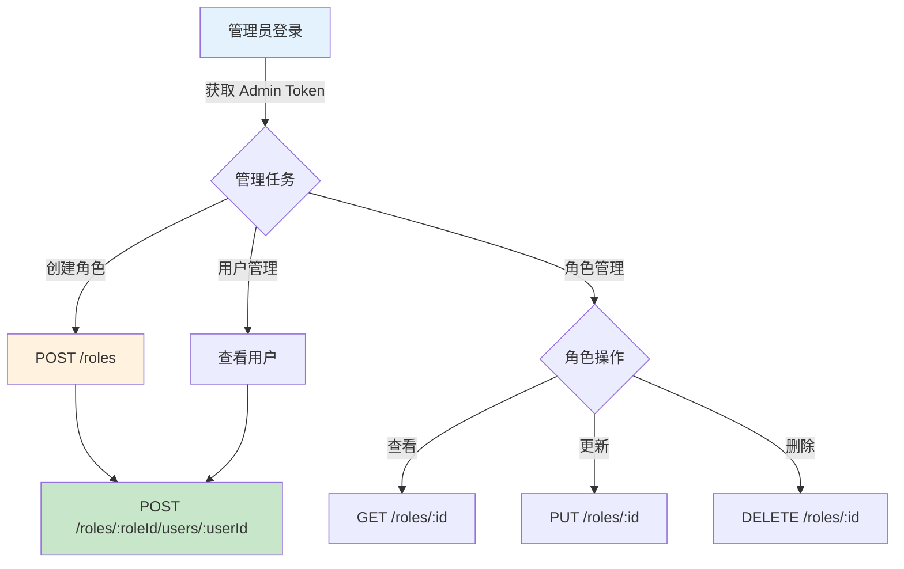

# 角色管理 API

角色 CRUD 和用户角色关联管理接口。

## 基础信息

**基础路径**: `/api/roles`  
**认证要求**: ✅ 所有接口都需要 JWT Token  
**权限要求**: ✅ **所有接口都需要 `ADMIN` 角色**  
**响应格式**: `Result<T>`

> ⚠️ **权限限制**: 此模块的所有接口都使用 `@PreAuthorize("hasRole('ADMIN')")`，非管理员无法访问。

---

## POST /api/roles

创建角色

### 请求

**URL**: `POST /api/roles`  
**权限**: `ADMIN`  
**Content-Type**: `application/json`

**请求体** (`RoleDTO`):

| 字段 | 类型 | 必填 | 说明 | 验证规则 |
|------|------|------|------|----------|
| roleName | String | ✅ | 角色名称 | 3-50个字符 |
| roleKey | String | ✅ | 角色标识 | 大写字母+下划线，如 `EDITOR` |
| description | String | ❌ | 角色描述 | 最多200个字符 |
| status | Integer | ❌ | 状态 | 0=禁用, 1=启用（默认1）|

### 响应

**成功** (HTTP 200):

```json
{
  "code": 0,
  "message": "Success",
  "data": 3
}
```

返回新创建角色的 ID。

### 示例

```bash
curl -X POST http://localhost:8080/api/roles \
  -H "Authorization: Bearer {admin_token}" \
  -H "Content-Type: application/json" \
  -d '{
    "roleName": "编辑",
    "roleKey": "EDITOR",
    "description": "文章编辑权限",
    "status": 1
  }'
```

---

## GET /api/roles/`{id}`

获取角色详情

### 请求

**URL**: `GET /api/roles/{id}`  
**权限**: `ADMIN`

**路径参数**:

| 参数 | 类型 | 说明 |
|------|------|------|
| id | Long | 角色ID |

### 响应

**成功** (HTTP 200):

```json
{
  "code": 0,
  "message": "Success",
  "data": {
    "id": 1,
    "roleName": "管理员",
    "roleKey": "ADMIN",
    "description": "系统管理员",
    "status": 1,
    "createdAt": "2025-12-01T10:00:00"
  }
}
```

**失败场景**:

| Code | 消息 | 原因 |
|------|------|------|
| 404 | 角色不存在 | ID 不存在 |

### 示例

```bash
curl -X GET http://localhost:8080/api/roles/1 \
  -H "Authorization: Bearer {admin_token}"
```

---

## PUT /api/roles/`{id}`

更新角色信息

### 请求

**URL**: `PUT /api/roles/{id}`  
**权限**: `ADMIN`  
**Content-Type**: `application/json`

**请求体** (`RoleDTO`):

| 字段 | 可更新 | 说明 |
|------|--------|------|
| roleName | ✅ | 角色名称 |
| roleKey | ⚠️ | 角色标识（慎改，影响权限判断）|
| description | ✅ | 角色描述 |
| status | ✅ | 状态 |

### 响应

**成功** (HTTP 200):

```json
{
  "code": 0,
  "message": "Success",
  "data": null
}
```

### 示例

```bash
# 更新角色描述
curl -X PUT http://localhost:8080/api/roles/3 \
  -H "Authorization: Bearer {admin_token}" \
  -H "Content-Type: application/json" \
  -d '{
    "description": "文章编辑和审核权限"
  }'

# 禁用角色
curl -X PUT http://localhost:8080/api/roles/3 \
  -H "Authorization: Bearer {admin_token}" \
  -H "Content-Type: application/json" \
  -d '{
    "status": 0
  }'
```

---

## DELETE /api/roles/`{id}`

删除角色

### 请求

**URL**: `DELETE /api/roles/{id}`  
**权限**: `ADMIN`

**路径参数**:

| 参数 | 类型 | 说明 |
|------|------|------|
| id | Long | 角色ID |

### 响应

**成功** (HTTP 200):

```json
{
  "code": 0,
  "message": "Success",
  "data": null
}
```

> ⚠️ **删除警告**: 
> - 删除角色前应检查是否有用户关联
> - 建议先禁用角色（status=0），观察一段时间后再删除
> - 删除操作是幂等的

### 示例

```bash
curl -X DELETE http://localhost:8080/api/roles/3 \
  -H "Authorization: Bearer {admin_token}"
```

---

## POST /api/roles/`{roleId}`/users/`{userId}`

为用户分配角色

### 请求

**URL**: `POST /api/roles/{roleId}/users/{userId}`  
**权限**: `ADMIN`

**路径参数**:

| 参数 | 类型 | 说明 |
|------|------|------|
| roleId | Long | 角色ID |
| userId | Long | 用户ID |

### 响应

**成功** (HTTP 200):

```json
{
  "code": 0,
  "message": "Success",
  "data": null
}
```

**失败场景**:

| Code | 消息 | 原因 |
|------|------|------|
| 500 | 分配角色失败 | 用户或角色不存在，或已分配 |

### 示例

```bash
# 为用户 ID=5 分配 EDITOR 角色
curl -X POST http://localhost:8080/api/roles/3/users/5 \
  -H "Authorization: Bearer {admin_token}"
```

---

## DELETE /api/roles/`{roleId}`/users/`{userId}`

移除用户角色

### 请求

**URL**: `DELETE /api/roles/{roleId}/users/{userId}`  
**权限**: `ADMIN`

**路径参数**:

| 参数 | 类型 | 说明 |
|------|------|------|
| roleId | Long | 角色ID |
| userId | Long | 用户ID |

### 响应

**成功** (HTTP 200):

```json
{
  "code": 0,
  "message": "Success",
  "data": null
}
```

### 示例

```bash
# 移除用户 ID=5 的 EDITOR 角色
curl -X DELETE http://localhost:8080/api/roles/3/users/5 \
  -H "Authorization: Bearer {admin_token}"
```

---

## 使用流程



---

## 常见场景

### 场景1: 创建编辑角色并分配

```bash
ADMIN_TOKEN="..."

# 1. 创建 EDITOR 角色
ROLE_ID=$(curl -X POST http://localhost:8080/api/roles \
  -H "Authorization: Bearer $ADMIN_TOKEN" \
  -H "Content-Type: application/json" \
  -d '{
    "roleName": "编辑",
    "roleKey": "EDITOR",
    "description": "文章编辑权限"
  }' | jq -r '.data')

echo "创建角色 ID: $ROLE_ID"

# 2. 为用户分配角色
curl -X POST http://localhost:8080/api/roles/$ROLE_ID/users/5 \
  -H "Authorization: Bearer $ADMIN_TOKEN"

echo "角色分配成功"
```

### 场景2: 查看用户的所有角色

```bash
# 1. 获取用户信息（包含角色列表）
curl -X GET http://localhost:8080/api/users/5 \
  -H "Authorization: Bearer $ADMIN_TOKEN" \
  | jq '.data.roles'

# 输出: ["USER", "EDITOR"]
```

### 场景3: 临时禁用角色

```bash
# 禁用 EDITOR 角色（所有拥有此角色的用户权限立即失效）
curl -X PUT http://localhost:8080/api/roles/3 \
  -H "Authorization: Bearer $ADMIN_TOKEN" \
  -H "Content-Type: application/json" \
  -d '{"status": 0}'
```

---

## 角色设计建议

### 预定义角色

| roleKey | roleName | 说明 |
|---------|----------|------|
| ADMIN | 管理员 | 系统管理员，拥有所有权限 |
| USER | 普通用户 | 默认角色，基础权限 |
| EDITOR | 编辑 | 文章编辑权限 |
| MODERATOR | 审核员 | 评论审核权限 |
| GUEST | 访客 | 只读权限 |

### 权限命名规范

- 使用大写字母 + 下划线
- 示例: `ADMIN`, `CONTENT_EDITOR`, `COMMENT_MODERATOR`
- Spring Security 会自动添加 `ROLE_` 前缀

### 角色层级设计

```
SUPER_ADMIN (超级管理员)
  └─ ADMIN (管理员)
      ├─ EDITOR (编辑)
      ├─ MODERATOR (审核员)
      └─ USER (普通用户)
          └─ GUEST (访客)
```

---

## 权限验证

### Controller 层权限注解

```java
// 方法级别权限控制
@PreAuthorize("hasRole('ADMIN')")
public Result<Void> deleteUser(@PathVariable Long id) { ... }

// 支持多角色（OR）
@PreAuthorize("hasAnyRole('ADMIN', 'EDITOR')")
public Result<Void> publishArticle(@RequestBody ArticleDTO dto) { ... }

// 支持表达式
@PreAuthorize("hasRole('ADMIN') or @userSecurity.isOwner(#id)")
public Result<Void> updateArticle(@PathVariable Long id) { ... }
```

### 前端权限控制

```javascript
// 根据用户角色显示/隐藏按钮
if (user.roles.includes('ADMIN')) {
  showDeleteButton();
}
```

---

## 数据库设计

### 角色表 (sys_role)

```sql
CREATE TABLE sys_role (
  id BIGINT PRIMARY KEY AUTO_INCREMENT,
  role_name VARCHAR(50) NOT NULL COMMENT '角色名称',
  role_key VARCHAR(50) NOT NULL UNIQUE COMMENT '角色标识',
  description VARCHAR(200) COMMENT '角色描述',
  status TINYINT DEFAULT 1 COMMENT '状态 0=禁用 1=启用',
  created_at TIMESTAMP DEFAULT CURRENT_TIMESTAMP,
  updated_at TIMESTAMP DEFAULT CURRENT_TIMESTAMP ON UPDATE CURRENT_TIMESTAMP
);
```

### 用户角色关联表 (sys_user_role)

```sql
CREATE TABLE sys_user_role (
  user_id BIGINT NOT NULL,
  role_id BIGINT NOT NULL,
  PRIMARY KEY (user_id, role_id),
  FOREIGN KEY (user_id) REFERENCES sys_user(id),
  FOREIGN KEY (role_id) REFERENCES sys_role(id)
);
```

---

## 相关文档

- [用户管理 API](./users) - 用户信息管理
- [Security 配置](../infrastructure/security/overview) - 权限控制原理
- [开发规范](../development/standards) - RBAC 最佳实践
