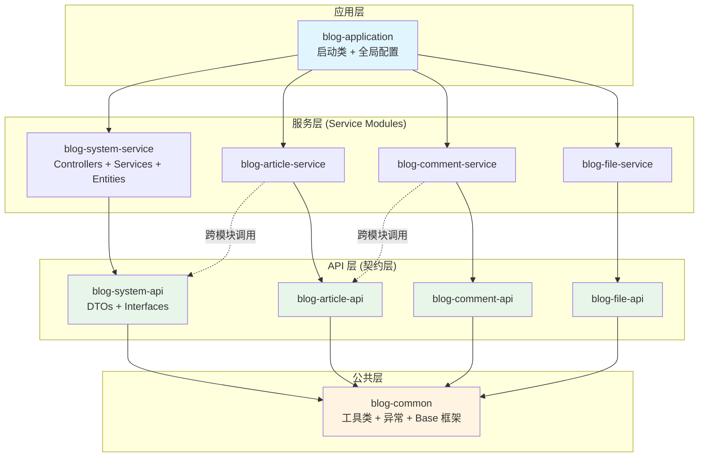

# 架构设计总览

Personal Blog Backend 采用 **模块化单体（Modular Monolith）** 架构，这是一种兼顾单体应用便捷性和微服务可扩展性的现代架构模式。

## 🎯 为什么选择模块化单体？

在项目初期，我们面临一个关键决策：

- **传统单体应用** ✅ 开发快、部署简单 ❌ 难以扩展、代码耦合
- **微服务架构** ✅ 高度解耦、易扩展 ❌ 复杂度高、运维成本大
- **模块化单体** ✅ 兼具两者优势 ✅ 未来可平滑演进

### 核心理念

:::tip 两个维度的架构
- **物理维度**：所有代码打包在**一个 JAR** 中，运行在**一个 JVM** 进程内
  - 部署简单：单一部署单元，无需服务网格
  - 性能优越：本地方法调用，无网络开销
  - 调试方便：单进程调试，问题定位快速

- **逻辑维度**：严格遵循**微服务拆分原则**，模块间高度隔离
  - 清晰边界：每个模块有明确的职责
  - 独立演进：模块可独立开发和测试
  - 易于拆分：未来可轻松转为微服务
:::

## 🏗️ 整体架构

### 项目结构

```
personal-blog-backend/
│
├── pom.xml                          # 🎯 父 POM（统一版本管理）
│
├── blog-application/                # 🚀 应用启动模块
│   ├── src/main/java/.../BlogApplication.java
│   ├── src/main/resources/
│   │   ├── application.yml          # 全局配置
│   │   └── db/migration/            # Flyway 数据库脚本
│   └── pom.xml
│
├── blog-common/                     # 🔧 公共基础模块
│   ├── src/main/java/.../
│   │   ├── model/                   # Result、PageResult 等
│   │   ├── exception/               # 统一异常处理
│   │   ├── utils/                   # 工具类
│   │   └── base/                    # BaseServiceImpl、BaseConverter
│   └── pom.xml
│
└── blog-modules/                    # 📦 业务模块聚合
    ├── pom.xml
    │
    ├── blog-system/                 # 🛡️ 系统管理模块
    │   ├── blog-system-api/         #    - API 定义（轻量级）
    │   │   ├── dto/                 #      * UserDTO, RoleDTO, ...
    │   │   ├── enums/               #      * UserStatus, Gender, ...
    │   │   └── service/             #      * RemoteUserService 接口
    │   └── blog-system-service/     #    - 服务实现（业务逻辑）
    │       ├── controller/          #      * UserController, RoleController
    │       ├── service/             #      * UserServiceImpl, RoleServiceImpl
    │       ├── entity/              #      * User, Role, UserRole
    │       ├── mapper/              #      * UserMapper, RoleMapper
    │       └── config/              #      * SecurityConfig
    │
    ├── blog-article/                # 📄 文章管理模块
    │   ├── blog-article-api/
    │   └── blog-article-service/
    │
    ├── blog-comment/                # 💬 评论管理模块
    │   ├── blog-comment-api/
    │   └── blog-comment-service/
    │
    └── blog-file/                   # 📁 文件管理模块
        ├── blog-file-api/
        └── blog-file-service/
```

### 架构分层



## 📋 模块职责详解

### 1. `*-api` 模块（API 定义层）

**定位**：对外暴露的**契约**，轻量、无依赖。

**类比**：餐厅的菜单 📋 - 只告诉你有什么菜，不告诉你怎么做。

**包含内容**：
- ✅ **DTO (Data Transfer Object)**: 数据传输对象
  ```java
  @Data
  @Schema(description = "用户信息")
  public class UserDTO implements Serializable, Identifiable<Long> {
      @Schema(description = "用户ID")
      private Long id;
      
      @Schema(description = "用户名")
      private String username;
      
      @Schema(description = "邮箱")
      private String email;
  }
  ```

- ✅ **Interfaces**: 远程调用接口（跨模块通信）
  ```java
  public interface RemoteUserService {
      UserDTO getUserById(Long id);
      List<UserDTO> getUsersByIds(List<Long> ids);
  }
  ```

- ✅ **Enums/Constants**: 枚举和常量
  ```java
  public enum UserStatus {
      ACTIVE, INACTIVE, LOCKED
  }
  ```

**严禁事项**：
- ❌ **不能包含**：Entity（数据库实体）
- ❌ **不能包含**：业务逻辑实现
- ❌ **不能依赖**：其他 Service 模块

### 2. `*-service` 模块（服务实现层）

**定位**：核心业务实现，私有、全功能。

**类比**：餐厅的后厨 👨‍🍳 - 真正做菜的地方。

**包含内容**：
- ✅ **Controller**: Web 层接口
  ```java
  @RestController
  @RequestMapping("/api/users")
  public class UserController {
      private final UserService userService;
      
      @GetMapping("/{id}")
      public Result<UserDTO> getUser(@PathVariable Long id) {
          return Result.success(userService.getById(id));
      }})
  }
  ```

- ✅ **Service Impl**: 业务逻辑实现
  ```java
  @Service
  @RequiredArgsConstructor
  public class UserServiceImpl extends BaseServiceImpl<...> 
          implements UserService, RemoteUserService {
      private final UserMapper userMapper;
      
      @Override
      public UserDTO getUserById(Long id) {
          User user = userMapper.selectById(id);
          return userConverter.toDto(user);
      }
  }
  ```

- ✅ **Entity**: 数据库实体类
  ```java
  @Data
  @TableName("sys_user")
  public class User extends BaseEntity {
      @TableId(type = IdType.ASSIGN_ID)
      private Long id;
      
      private String username;
      private String passwordHash;
  }
  ```

- ✅ **Mapper**: MyBatis-Plus 持久层接口
- ✅ **Config**: 模块私有配置（如 SecurityConfig）

:::important 关键规则
**Controller 必须位于 `*-service` 模块**，而不是 `blog-application`！
:::

### 3. `blog-application` 模块（启动器）

**定位**：应用的**组装者**和**启动入口**。

**职责**：
- ✅ 聚合所有 `*-service` 模块依赖
- ✅ 提供 `main` 方法启动 Spring Boot
- ✅ 包含全局配置（`application.yml`、Flyway 脚本）

**严禁事项**：
- ❌ **不能编写**：任何业务逻辑
- ❌ **不能创建**：Controller、Service、Entity

### 4. `blog-common` 模块（公共基础）

**定位**：项目的**工具箱**。

**包含内容**：
- ✅ 通用工具类（`StringUtils`, `DateUtils`）
- ✅ 统一响应模型（`Result<T>`, `PageResult<T>`）
- ✅ 全局异常处理（`BusinessException`, `ErrorCode`）
- ✅ Base 框架（`BaseServiceImpl`, `BaseConverter`）

:::warning 避免"上帝类"
不要将**业务对象**（如 `User` 实体）放入 `common`，这会导致所有模块都能随意修改它，破坏封装性。
:::

## 🔗 依赖规则（The Dependency Rule）

严格遵守以下依赖规则，确保模块间的隔离：

### ✅ 允许的依赖

```
blog-application  ──▶  blog-system-service
                  ──▶  blog-article-service
                  ──▶  blog-comment-service
                  ──▶  blog-file-service

blog-*-service    ──▶  blog-*-api (自己的 API)
                  ──▶  blog-common
                  ──▶  其他模块的 blog-*-api (跨模块调用)

blog-*-api        ──▶  blog-common
```

### ❌ 严禁的依赖

```
blog-*-service ✖──▶ 其他 blog-*-service  # 严禁 Service 直接依赖 Service
blog-*-api     ✖──▶ 任何 blog-*-service   # API 不能依赖实现
blog-common    ✖──▶ 任何业务模块          # Common 不能依赖业务
```

:::danger 为什么严禁 Service → Service？
一旦允许 `blog-article-service` 依赖 `blog-system-service`，两个模块就紧密耦合了：
- 无法独立部署
- 无法独立测试
- 未来无法拆分为微服务

**正确做法**：通过接口调用 `blog-system-api.RemoteUserService`，Spring 会自动注入本地实现。
:::

## 🚫 架构红线（Precautions）

为了确保架构不腐化，以下规则**必须严格遵守**：

### 1. 禁止跨模块数据库 JOIN

❌ **错误示例**：
```sql
-- 文章模块直接 JOIN 用户表
SELECT a.*, u.username 
FROM art_article a 
JOIN sys_user u ON a.author_id = u.id
```

✅ **正确做法**：
```java
// 1. 文章服务查询文章
List<Article> articles = articleMapper.selectList(...);

// 2. 通过 RemoteUserService 获取用户信息
List<Long> authorIds = articles.stream()
    .map(Article::getAuthorId)
    .collect(Collectors.toList());
List<UserDTO> users = remoteUserService.getUsersByIds(authorIds);

// 3. 在 Java 代码中组装数据
// ...
```

**理由**：微服务架构下，数据库是物理隔离的，JOIN 根本无法执行。

### 2. 接口即契约

- 模块间调用**必须通过接口**（定义在 `*-api` 中）
- Spring 会自动注入本地实现（`@Service` 实现类）
- 未来切换为 Feign Client 时，业务代码**无需修改**

### 3. 实体不外传

- **Entity** 是模块的私有资产，只能在 `*-service` 内部使用
- 对外交互**必须使用 DTO**，通过 MapStruct 转换

### 4. Controller 归属

- 所有 Controller **必须**位于 `*-service` 模块
- `blog-application` **只负责启动**，不包含业务代码

## 🔄 未来演进路线

当某个模块（如文章模块）流量暴增，需要独立扩展时：

### 步骤 1：创建独立启动模块
```
blog-article-app/
├── src/main/java/.../ArticleApplication.java
├── src/main/resources/application.yml
└── pom.xml (依赖 blog-article-service)
```

### 步骤 2：配置独立数据库
```yaml
spring:
  datasource:
    url: jdbc:mysql://article-db:3306/blog_article
```

### 步骤 3：替换接口实现
在其他模块中，将 `RemoteArticleService` 的实现：
- **旧**：本地 `@Service` 实现
- **新**：Feign Client（远程调用）

```java
@FeignClient(name = "article-service", url = "http://article-service:8081")
public interface RemoteArticleService {
    @GetMapping("/api/articles/{id}")
    ArticleDTO getArticleById(@PathVariable Long id);
}
```

:::tip 核心优势
**整个过程无需重构业务代码**，因为：
- 模块边界清晰
- 始终通过接口调用
- 数据库早已隔离
:::

## 📚 延伸阅读

<!-- 以下页面即将推出 -->
- **模块化单体详解** - 深入理解模块化设计
- **依赖规则详解** - 为什么要这样设计
- **微服务演进路线** - 如何平滑拆分

---

**架构守护者**：项目使用 ArchUnit 自动化测试架构规则，确保代码不违反设计原则。
