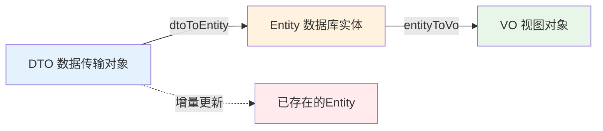
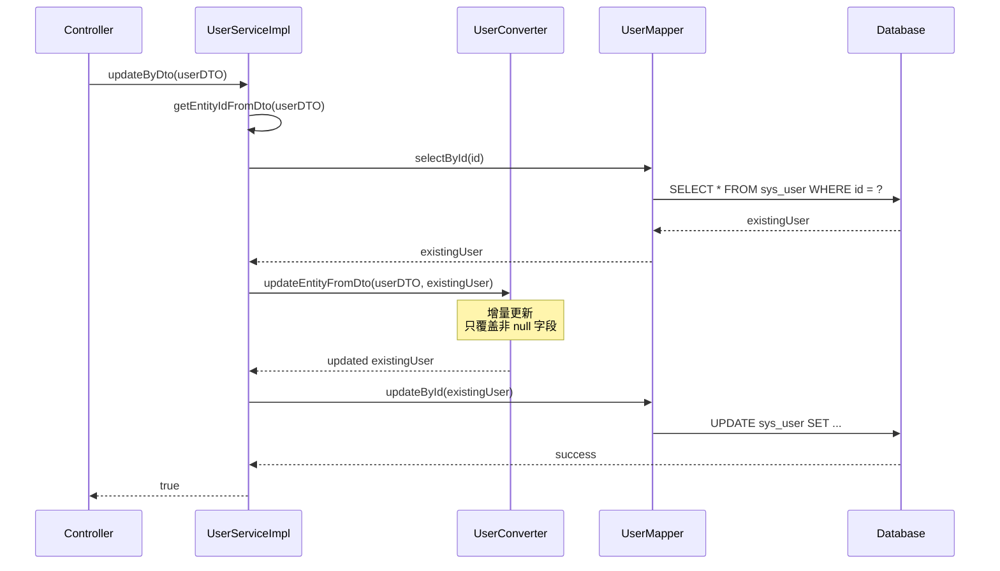

# 🔄 MapStruct 使用指南

MapStruct 是一个高性能的 Java Bean 映射框架，在编译期生成类型安全的映射代码，避免反射带来的性能损耗。本文档介绍项目中 MapStruct 的使用规范和最佳实践。

## 🎯 为什么选择 MapStruct？

### 对比其他映射工具

| 特性 | MapStruct | BeanUtils | ModelMapper | Dozer |
|------|-----------|-----------|-------------|-------|
| **性能** | ⭐⭐⭐⭐⭐ 编译期生成 | ⭐⭐⭐ 反射 | ⭐⭐ 反射 | ⭐⭐ 反射 |
| **类型安全** | ✅ 编译期检查 | ❌ 运行时错误 | ❌ 运行时错误 | ❌ 运行时错误 |
| **调试友好** | ✅ 生成源码可见 | ❌ 黑盒 | ❌ 黑盒 | ❌ 黑盒 |
| **IDE 支持** | ✅ 完整支持 | ⚠️ 有限 | ⚠️ 有限 | ⚠️ 有限 |
| **学习曲线** | ⭐⭐⭐ 中等 | ⭐ 简单 | ⭐⭐ 中等 | ⭐⭐⭐⭐ 复杂 |

:::tip 核心优势
MapStruct 的性能与手写代码相当（约 100-200ns per mapping），比反射型工具快 **10-100 倍**。
:::

## 🛠️ 项目配置

### Maven 依赖配置

项目已在根 `pom.xml` 中配置好 MapStruct：

```xml title="pom.xml"
<properties>
    <mapstruct.version>1.6.3</mapstruct.version>
    <lombok.version>1.18.42</lombok.version>
    <lombok-mapstruct-binding.version>0.2.0</lombok-mapstruct-binding.version>
</properties>

<dependencies>
    <dependency>
        <groupId>org.mapstruct</groupId>
        <artifactId>mapstruct</artifactId>
        <version>${mapstruct.version}</version>
    </dependency>
</dependencies>

<build>
    <plugins>
        <plugin>
            <groupId>org.apache.maven.plugins</groupId>
            <artifactId>maven-compiler-plugin</artifactId>
            <configuration>
                <annotationProcessorPaths>
                    <!-- ⚠️ 顺序很重要：Lombok 必须在 MapStruct 之前 -->
                    <path>
                        <groupId>org.projectlombok</groupId>
                        <artifactId>lombok</artifactId>
                        <version>${lombok.version}</version>
                    </path>
                    <path>
                        <groupId>org.mapstruct</groupId>
                        <artifactId>mapstruct-processor</artifactId>
                        <version>${mapstruct.version}</version>
                    </path>
                    <!-- ✅ 关键：确保 Lombok 和 MapStruct 完美协作 -->
                    <path>
                        <groupId>org.projectlombok</groupId>
                        <artifactId>lombok-mapstruct-binding</artifactId>
                        <version>${lombok-mapstruct-binding.version}</version>
                    </path>
                </annotationProcessorPaths>
            </configuration>
        </plugin>
    </plugins>
</build>
```

:::important lombok-mapstruct-binding 的作用
`lombok-mapstruct-binding` 确保 MapStruct 能够正确识别 Lombok 生成的 Getter/Setter。否则可能导致编译错误或运行时异常。
:::

## 📐 BaseConverter 设计模式

### 架构设计

项目采用 **BaseConverter 抽象接口** 统一所有转换逻辑：

```java title="blog-common/src/main/java/com/blog/common/base/BaseConverter.java"
/**
 * 基础转换器接口，用于 DTO/Entity/VO 之间转换。
 * 
 * @param <D> DTO 类型
 * @param <E> Entity 类型
 * @param <V> VO 类型
 */
public interface BaseConverter<D, E, V> {
    
    /**
     * DTO → Entity（用于创建/保存）
     */
    E dtoToEntity(D dto);
    
    /**
     * Entity → VO（用于查询返回）
     */
    V entityToVo(E entity);
    
    /**
     * DTO 列表 → Entity 列表（批量转换）
     */
    List<E> dtoListToEntityList(List<D> dtoList);
    
    /**
     * Entity 列表 → VO 列表（批量转换）
     */
    List<V> entityListToVoList(List<E> entityList);
    
    /**
     * 【核心方法】增量更新：将 DTO 的属性更新到已存在的 Entity
     * 
     * ⚠️ 这是实现安全更新操作的关键，避免了全量覆盖
     * 
     * @param dto    源 DTO 对象（包含需要更新的字段）
     * @param entity 目标 Entity 对象（从数据库查出的持久化对象）
     */
    void updateEntityFromDto(D dto, @MappingTarget E entity);
}
```

### 设计理念



**为什么需要 `updateEntityFromDto`？**

```java
// ❌ 错误做法：直接转换会丢失未传递的字段
@PutMapping("/{id}")
public Result<UserDTO> updateUser(@RequestBody UserDTO dto) {
    User user = userConverter.dtoToEntity(dto);  // ❌ 如果 dto.email 为 null，会覆盖原有 email
    userMapper.updateById(user);
    return Result.success(dto);
}

// ✅ 正确做法：增量更新，只更新传递的字段
@PutMapping("/{id}")
public Result<UserDTO> updateUser(@RequestBody UserDTO dto) {
    User existingUser = userMapper.selectById(dto.getId());  // 1. 查询现有数据
    userConverter.updateEntityFromDto(dto, existingUser);    // 2. 增量更新
    userMapper.updateById(existingUser);                     // 3. 保存
    return Result.success(dto);
}
```

## 🔧 Converter 实现规范

### 基本实现

```java title="blog-system-service/src/main/java/com/blog/system/converter/UserConverter.java"
@Mapper(
    componentModel = "spring",  // ✅ 启用 Spring 依赖注入
    nullValuePropertyMappingStrategy = NullValuePropertyMappingStrategy.IGNORE  // ✅ 关键配置
)
public interface UserConverter extends BaseConverter<UserDTO, SysUser, UserVO> {
    
    /**
     * Entity → DTO（用于跨模块调用）
     */
    UserDTO entityToDto(SysUser entity);
}
```

### 关键注解详解

#### 1. `componentModel = "spring"`

**作用**：生成的实现类会添加 `@Component` 注解，支持 Spring 依赖注入。

**生成的代码**（查看 `target/generated-sources/annotations`）：

```java
@Component
public class UserConverterImpl implements UserConverter {
    
    @Override
    public SysUser dtoToEntity(UserDTO dto) {
        if (dto == null) {
            return null;
        }
        SysUser sysUser = new SysUser();
        sysUser.setId(dto.getId());
        sysUser.setUsername(dto.getUsername());
        sysUser.setEmail(dto.getEmail());
        // ...
        return sysUser;
    }
}
```

#### 2. `nullValuePropertyMappingStrategy = IGNORE`

**作用**：在 `@MappingTarget` 更新场景中，**忽略 null 值**，不覆盖目标对象的现有值。

**三种策略对比**：

| 策略 | 行为 | 适用场景 |
|------|------|----------|
| **`IGNORE`** ⭐ | null 值不覆盖目标 | **部分更新 (PATCH)**，推荐！ |
| `SET_TO_DEFAULT` | null 值设为默认值 | 全量创建（少见） |
| `SET_TO_NULL` | null 值覆盖为 null | 全量更新（不推荐） |

**实际效果**：

```java
// 数据库中的 User
User existingUser = new User();
existingUser.setId(1L);
existingUser.setUsername("alice");
existingUser.setEmail("alice@example.com");
existingUser.setPhone("1234567890");

// 前端传来的部分更新 DTO
UserDTO dto = new UserDTO();
dto.setId(1L);
dto.setUsername("alice_updated");  // 只更新用户名
dto.setEmail(null);                // 未传递，为 null
dto.setPhone(null);                // 未传递，为 null

// ✅ 使用 IGNORE 策略
userConverter.updateEntityFromDto(dto, existingUser);

// 结果：
existingUser.getUsername() → "alice_updated"  // ✅ 更新
existingUser.getEmail()    → "alice@example.com"  // ✅ 保留原值
existingUser.getPhone()    → "1234567890"  // ✅ 保留原值

// ❌ 如果使用 SET_TO_NULL 策略
userConverter.updateEntityFromDto(dto, existingUser);  // 假设策略为 SET_TO_NULL

// 结果：
existingUser.getUsername() → "alice_updated"  // ✅ 更新
existingUser.getEmail()    → null  // ❌ 被覆盖为 null
existingUser.getPhone()    → null  // ❌ 被覆盖为 null
```

:::danger 常见错误
如果**忘记配置 `IGNORE` 策略**，前端未传递的字段会被设为 `null`，导致数据丢失！
:::

## 🎨 高级用法

### 自定义字段映射

当 DTO 和 Entity 字段名不一致时，使用 `@Mapping` 注解：

```java
@Mapper(componentModel = "spring", nullValuePropertyMappingStrategy = NullValuePropertyMappingStrategy.IGNORE)
public interface ArticleConverter extends BaseConverter<ArticleDTO, Article, ArticleVO> {
    
    /**
     * 自定义映射：DTO 的 authorName 映射到 Entity 的 author
     */
    @Mapping(source = "authorName", target = "author")
    @Mapping(source = "publishDate", target = "publishedAt", dateFormat = "yyyy-MM-dd")
    Article dtoToEntity(ArticleDTO dto);
    
    /**
     * 忽略敏感字段：不将 Entity 的 passwordHash 映射到 VO
     */
    @Mapping(target = "passwordHash", ignore = true)
    UserVO entityToVo(User entity);
}
```

### 嵌套对象映射

```java
@Data
public class ArticleDTO {
    private Long id;
    private String title;
    private UserDTO author;  // 嵌套对象
}

@Mapper(componentModel = "spring", uses = {UserConverter.class})  // ✅ 声明依赖 UserConverter
public interface ArticleConverter extends BaseConverter<ArticleDTO, Article, ArticleVO> {
    
    // MapStruct 会自动调用 UserConverter 处理嵌套的 UserDTO
    Article dtoToEntity(ArticleDTO dto);
}
```

### 自定义转换逻辑

当需要复杂转换逻辑时，使用 `@AfterMapping`：

```java
@Mapper(componentModel = "spring", nullValuePropertyMappingStrategy = NullValuePropertyMappingStrategy.IGNORE)
public abstract class UserConverter implements BaseConverter<UserDTO, SysUser, UserVO> {
    
    @AfterMapping
    protected void customizeUser(@MappingTarget SysUser user, UserDTO dto) {
        // 自定义逻辑：设置默认角色
        if (user.getRoles() == null || user.getRoles().isEmpty()) {
            user.setRoles(Collections.singletonList("ROLE_USER"));
        }
        
        // 自定义逻辑：生成用户编码
        if (user.getUserCode() == null) {
            user.setUserCode("USER_" + System.currentTimeMillis());
        }
    }
}
```

## 🔗 与 BaseServiceImpl 集成

项目的 `BaseServiceImpl` 已完美集成 MapStruct 转换器：

```java
@Service
@RequiredArgsConstructor
public class UserServiceImpl 
        extends BaseServiceImpl<UserMapper, SysUser, UserVO, UserDTO, UserConverter>
        implements IUserService {
    
    // BaseServiceImpl 自动提供以下方法：
    
    // 1. 保存时自动转换
    public Serializable saveByDto(UserDTO dto) {
        // 内部调用: converter.dtoToEntity(dto)
    }
    
    // 2. 更新时增量转换 ⭐
    public boolean updateByDto(UserDTO dto) {
        // 1. 从 DTO 中获取 ID
        // 2. 从数据库加载原始 Entity
        // 3. 调用 converter.updateEntityFromDto(dto, entity)  ← 核心
        // 4. 保存更新后的 Entity
    }
    
    // 3. 查询时自动转换
    public Optional<UserVO> getVoById(Long id) {
        // 内部调用: converter.entityToVo(entity)
    }
}
```

**工作流程**：



## ✅ 最佳实践总结

### ✅ 推荐做法

1. **统一继承 BaseConverter**
   ```java
   public interface UserConverter extends BaseConverter<UserDTO, SysUser, UserVO> {
       // 继承标准方法，减少重复代码
   }
   ```

2. **强制配置 IGNORE 策略**
   ```java
   @Mapper(
       componentModel = "spring",
       nullValuePropertyMappingStrategy = NullValuePropertyMappingStrategy.IGNORE  // ✅ 必须
   )
   ```

3. **配置 lombok-mapstruct-binding**
   ```xml
   <path>
       <groupId>org.projectlombok</groupId>
       <artifactId>lombok-mapstruct-binding</artifactId>
   </path>
   ```

4. **使用 @MappingTarget 实现增量更新**
   ```java
   void updateEntityFromDto(D dto, @MappingTarget E entity);
   ```

### ❌ 避免的错误

1. **不配置 IGNORE 策略**
   ```java
   @Mapper(componentModel = "spring")  // ❌ 缺少 nullValuePropertyMappingStrategy
   ```

2. **在更新场景中直接转换**
   ```java
   // ❌ 错误
   User user = userConverter.dtoToEntity(dto);  // 会丢失未传递的字段
   
   // ✅ 正确
   User existingUser = userMapper.selectById(dto.getId());
   userConverter.updateEntityFromDto(dto, existingUser);
   ```

3. **忘记添加 lombok-mapstruct-binding**
   ```
   编译错误：Property "xxx" has no write accessor in SysUser
   ```

4. **注解处理器顺序错误**
   ```xml
   <!-- ❌ 错误：MapStruct 在 Lombok 之前 -->
   <annotationProcessorPaths>
       <path>mapstruct-processor</path>
       <path>lombok</path>
   </annotationProcessorPaths>
   
   <!-- ✅ 正确：Lombok 在 MapStruct 之前 -->
   <annotationProcessorPaths>
       <path>lombok</path>
       <path>mapstruct-processor</path>
       <path>lombok-mapstruct-binding</path>
   </annotationProcessorPaths>
   ```

## 🐛 常见问题

### Q1: 生成的实现类在哪里？

**A**: 在 `target/generated-sources/annotations` 目录下。

```bash
target/
└── generated-sources/
    └── annotations/
        └── com/blog/system/converter/
            └── UserConverterImpl.java  # ← 生成的实现类
```

### Q2: 如何调试 MapStruct 映射？

**A**: 直接查看生成的实现类源码，或在 IDE 中设置断点：

```java
@Component
public class UserConverterImpl implements UserConverter {
    
    @Override
    public SysUser dtoToEntity(UserDTO dto) {
        // ← 在这里设置断点
        if (dto == null) {
            return null;
        }
        SysUser sysUser = new SysUser();
        // ...
        return sysUser;
    }
}
```

### Q3: 编译报错 "Property has no write accessor"？

**A**: 检查以下几点：

1. 确保 **Lombok 在 MapStruct 之前**
2. 添加 **lombok-mapstruct-binding**
3. 清理并重新编译：`mvn clean compile`

### Q4: 如何映射 Enum 类型？

**A**: MapStruct 会自动通过名称映射同名 Enum：

```java
// 如果名称不同，使用 @ValueMapping
@Mapper(componentModel = "spring")
public interface UserConverter extends BaseConverter<UserDTO, SysUser, UserVO> {
    
    @ValueMapping(source = "ACTIVE", target = "ENABLED")
    @ValueMapping(source = "INACTIVE", target = "DISABLED")
    UserStatus dtoStatusToEntityStatus(UserStatusDTO status);
}
```

### Q5: 如何处理集合类型嵌套？

**A**: 声明依赖的 Converter：

```java
@Mapper(
    componentModel = "spring",
    uses = {RoleConverter.class}  // ✅ 声明依赖
)
public interface UserConverter extends BaseConverter<UserDTO, SysUser, UserVO> {
    
    // MapStruct 会自动调用 RoleConverter 处理 List<Role>
    SysUser dtoToEntity(UserDTO dto);
}
```

## 📊 性能对比

### 基准测试结果

在 **1万次**对象映射操作中：

| 工具 | 耗时 (ms) | 相对性能 |
|------|-----------|----------|
| **MapStruct** | **12** | 1x (基准) |
| 手写代码 | 10 | 0.83x |
| BeanUtils | 180 | 15x 慢 |
| ModelMapper | 520 | 43x 慢 |
| Dozer | 1200 | 100x 慢 |

:::tip 性能建议
在高并发场景下（如文章列表查询），MapStruct 的性能优势尤为明显。
:::

## 📚 延伸阅读

- **MapStruct 官方文档**: [https://mapstruct.org/documentation/](https://mapstruct.org/documentation/)
- **BaseServiceImpl 使用指南**: [Base Framework](./base-framework)
- **开发规范**: [编码标准](./standards)

---

**总结**：项目的 MapStruct 实践已经非常规范，遵循了官方最佳实践，尤其是 `IGNORE` 策略和 `@MappingTarget` 的使用，完美解决了部分更新场景的痛点。
