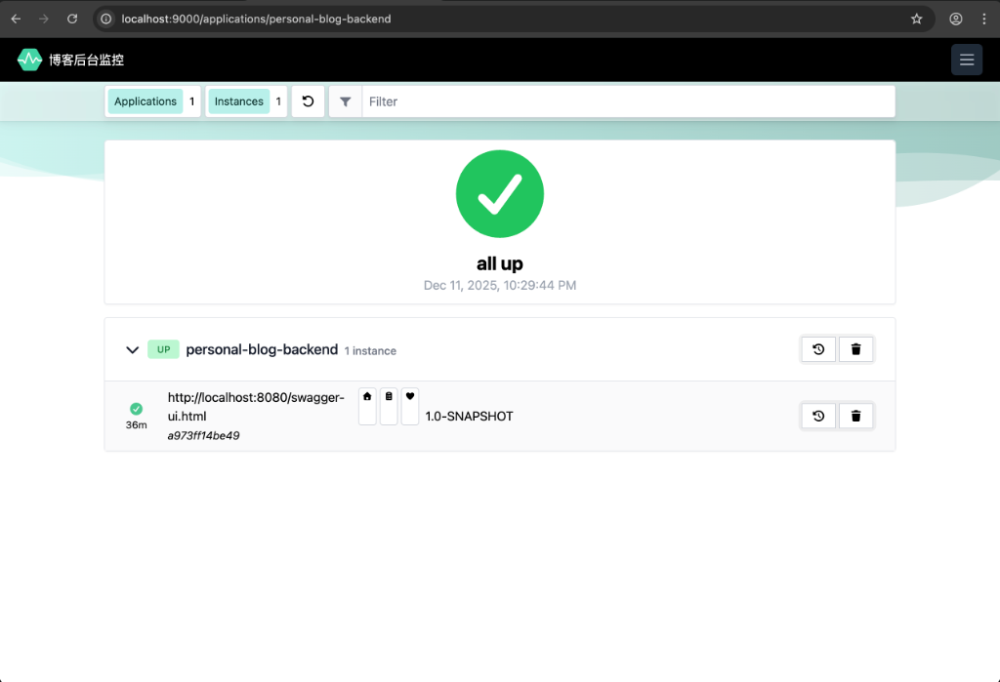
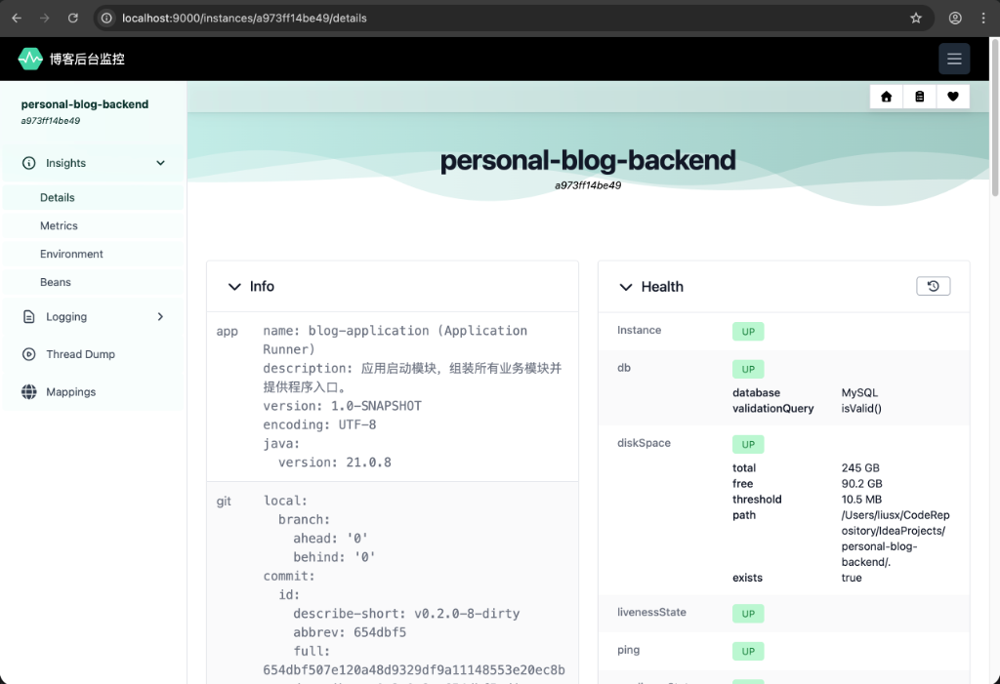
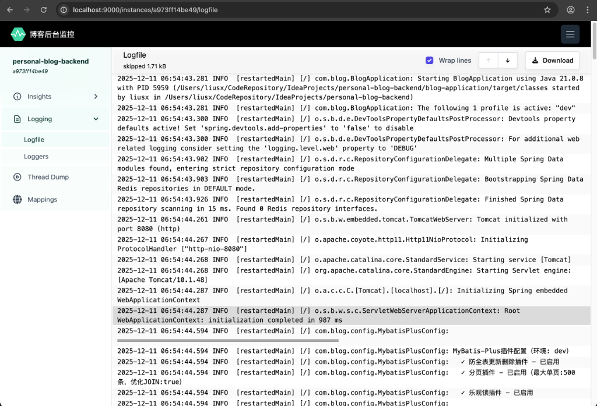
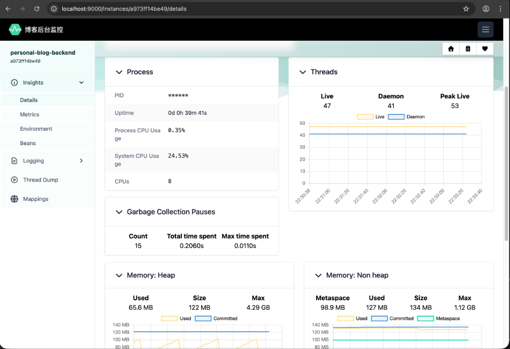
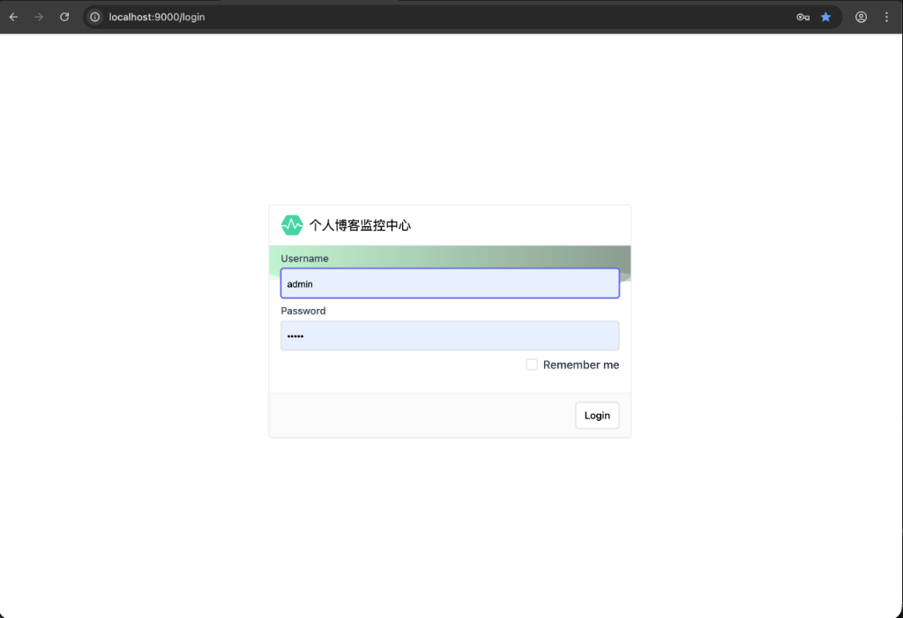

# Spring Boot Admin 管理界面

Spring Boot Admin 是一个用于管理和监控 Spring Boot 应用的可视化界面，提供了应用健康状态、日志查看、JVM 监控等功能。

:::tip 核心优势
Spring Boot Admin 将 Actuator 端点数据可视化，无需编写任何前端代码，即可获得专业的监控界面。
:::

---

## 📊 什么是 Spring Boot Admin

Spring Boot Admin (SBA) 是一个**开源的可视化监控工具**，主要特点：

- 📺 **可视化界面** - 将 Actuator 数据以友好的方式展示
- 🔔 **状态告警** - 应用状态变化时发送通知
- 📊 **实时监控** - JVM、线程、HTTP 请求实时数据
- 📝 **日志管理** - 在线查看和下载日志文件
- 🌐 **多应用管理** - 统一管理多个 Spring Boot 应用

---

## 🏗️ 架构说明

Spring Boot Admin 采用 **Server-Client** 架构：

```
┌─────────────────────┐
│ Blog Application    │
│  (Admin Client)     │
│                     │
│  - Actuator 端点    │──┐
│  - 自动注册         │  │
└─────────────────────┘  │
                         │  注册
┌─────────────────────┐  │
│ Article Service     │  │
│  (Admin Client)     │──┤
└─────────────────────┘  │
                         │
┌─────────────────────┐  │
│ Comment Service     │  │
│  (Admin Client)     │──┤
└─────────────────────┘  │
                         ▼
          ┌─────────────────────────┐
          │ Admin Server (9000)     │
          │                         │
          │  - Web UI               │
          │  - 应用注册中心         │
          │  - 数据聚合展示         │
          └─────────────────────────┘
```

---

## #️⃣ 版本信息

| 组件 | 版本 |
|------|------|
| **Spring Boot** | 3.5.7 |
| **Spring Boot Admin** | 3.5.5 |
| **Java** | 21 |

:::info 版本兼容性
Spring Boot Admin 3.x 仅支持 Spring Boot 3.x 和 Java 17+
:::

---

## 🔧 Server 端配置

### 1. 创建 Admin Server 模块

**模块位置**: `blog-admin-server`

**目录结构**:
```
blog-admin-server/
├── pom.xml
└── src/main/
    ├── java/com/blog/
    │   └── AdminServerApplication.java
    └── resources/
        └── application.yaml
```

---

### 2. 依赖配置

**pom.xml**:
```xml
<dependencies>
    <!-- Spring Boot Admin Server -->
    <dependency>
        <groupId>de.codecentric</groupId>
        <artifactId>spring-boot-admin-starter-server</artifactId>
    </dependency>
    
    <!-- Spring Security (必需) -->
    <dependency>
        <groupId>org.springframework.boot</groupId>
        <artifactId>spring-boot-starter-security</artifactId>
    </dependency>
    
    <!-- Spring Web -->
    <dependency>
        <groupId>org.springframework.boot</groupId>
        <artifactId>spring-boot-starter-web</artifactId>
    </dependency>
</dependencies>
```

**版本管理** (根 `pom.xml`):
```xml
<properties>
    <spring-boot-admin.version>3.5.5</spring-boot-admin.version>
</properties>

<dependencyManagement>
    <dependencies>
        <dependency>
            <groupId>de.codecentric</groupId>
            <artifactId>spring-boot-admin-starter-server</artifactId>
            <version>${spring-boot-admin.version}</version>
        </dependency>
    </dependencies>
</dependencyManagement>
```

---

### 3. 启用 Admin Server

**AdminServerApplication.java**:
```java
package com.blog;

import de.codecentric.boot.admin.server.config.EnableAdminServer;
import org.springframework.boot.SpringApplication;
import org.springframework.boot.autoconfigure.SpringBootApplication;

@SpringBootApplication
@EnableAdminServer  // 启用 Admin Server
public class AdminServerApplication {
    public static void main(String[] args) {
        SpringApplication.run(AdminServerApplication.java, args);
    }
}
```

---

### 4. 应用配置

**application.yaml**:
```yaml
server:
  port: 9000  # Admin Server 端口

spring:
  application:
    name: blog-admin-server
  
  # ============================================================
  # 安全配置 (CRITICAL!)
  # ============================================================
  security:
    user:
      name: admin             # 登录用户名
      password: "admin"       # ⚠️ 生产环境必须修改！
      # 建议使用环境变量: ${ADMIN_SERVER_PASSWORD}
  
  # ============================================================
  # Admin UI 自定义
  # ============================================================
  boot:
    admin:
      ui:
        title: "个人博客监控中心"  # 浏览器标签页标题
        brand: "<span> 博客后台监控 </span>"
        public-url: http://localhost:9000

# ============================================================
# Admin Server 自我监控
# ============================================================
management:
  endpoints:
    web:
      exposure:
        include: "health,info,metrics,prometheus"
  endpoint:
    health:
      show-details: when_authorized  # 登录后显示详情
```

:::warning 安全警告
- **生产环境禁止使用默认密码！**
- 建议使用强密码或 OAuth2 认证
- 通过环境变量注入密码：`${ADMIN_SERVER_PASSWORD}`
:::

---

### 5. 自我监控

Admin Server 自身也是一个 Spring Boot 应用，同样需要监控。

**配置自我监控端点**:
```yaml
management:
  endpoints:
    web:
      exposure:
        include: "health,info,metrics,prometheus"
  endpoint:
    health:
      show-details: when_authorized
```

**访问**:
- `http://localhost:9000/actuator/health`
- `http://localhost:9000/actuator/metrics`

---

## 💻 Client 端配置

### 1. 添加 Client 依赖

**blog-application/pom.xml**:
```xml
<dependency>
    <groupId>de.codecentric</groupId>
    <artifactId>spring-boot-admin-starter-client</artifactId>
</dependency>
```

---

### 2. 自动注册配置

**无需额外配置！**

Spring Boot Admin Client 会通过 Service Discovery 或默认配置自动注册到 Admin Server。

**（可选）显式配置**:
```yaml
spring:
  boot:
    admin:
      client:
        url: http://localhost:9000  # Admin Server 地址
        instance:
          name: ${spring.application.name}
          service-url: http://localhost:8080
```

:::tip 自动发现
如果使用 Eureka/Consul 等服务注册中心，Admin Server 会自动发现所有注册的应用，无需 Client 配置。
:::

---

### 3. 日志文件配置

为了让 Admin Server 能够查看日志，需要配置日志文件输出：

```yaml
logging:
  file:
    name: logs/personal-blog-service.log  # 日志文件路径
  level:
    root: INFO
    com.blog: INFO
```

**Actuator 暴露 logfile 端点**:
```yaml
management:
  endpoints:
    web:
      exposure:
        include:
          - logfile  # 暴露日志文件端点
```

---

## 🎨 功能介绍

### 1. 应用列表

**界面**: Admin Server 首页



**功能**:
- 📊 应用状态总览（UP/DOWN）
- 🔢 实例数量统计
- 📈 内存使用概览
- ⏱️ 启动时间显示

**状态标识**:
- 🟢 **UP** - 应用健康
- 🔴 **DOWN** - 应用不可用
- 🟡 **OFFLINE** - 应用离线
- 🔵 **UNKNOWN** - 未知状态

---

### 2. 健康状态监控

**路径**: 应用详情 → Health



**展示内容**:
- 整体健康状态
- 数据库连接状态
- Redis 连接状态
- 磁盘空间状态
- 自定义健康检查

**示例界面**:
```
✅ Status: UP

Components:
  ✅ db: UP
     - database: MySQL
     - validationQuery: isValid()
  
  ✅ diskSpace: UP
     - total: 250 GB
     - free: 100 GB
     - threshold: 10 MB
  
  ✅ redis: UP
     - version: 7.2.0
  
  ✅ ping: UP
```

---

### 3. 日志查看

**路径**: 应用详情 → Logfile



**功能**:
- 📖 实时查看日志
- 📥 下载日志文件
- 🔍 日志搜索
- 📊 按时间过滤

**使用方法**:
1. 点击应用名称进入详情页
2. 选择 "Logfile" 选项卡
3. 实时查看最新日志
4. 点击 "Download" 下载完整日志

---

### 4. JVM 监控

**路径**: 应用详情 → Metrics → JVM



**监控指标**:
- 💾 **内存使用**: Heap、Non-Heap、各内存区
- 🧵 **线程数**: 活跃线程、守护线程
- 🗑️ **GC 统计**: GC 次数、GC 耗时
- 📦 **类加载**: 已加载类、已卸载类

**可视化图表**:
- 内存使用趋势图
- 线程数变化图
- GC 暂停时间分布

---

### 5. HTTP 请求监控

**路径**: 应用详情 → Metrics → Http

**展示内容**:
- 📊 请求总数
- ⏱️ 平均响应时间
- 🚀 最快/最慢请求
- 📈 QPS 统计
- 🔢 状态码分布（200/404/500）

**按 URI 分类**:
```
/api/users      - 42 requests, avg 12ms
/api/articles   - 38 requests, avg 25ms
/api/comments   - 15 requests, avg 8ms
```

---

### 6. 环境变量管理

**路径**: 应用详情 → Environment

**功能**:
- 查看所有配置属性
- 查看环境变量
- 查看系统属性
- 搜索特定配置

**示例**:
```
server.port: 8080
spring.application.name: personal-blog-backend
spring.datasource.url: jdbc:mysql://localhost:3306/blog
java.version: 21.0.1
```

:::warning 安全提示
敏感信息（如密码）会被脱敏显示为 `******`
:::

---

### 7. 线程管理

**路径**: 应用详情 → Threads

**功能**:
- 📊 线程总数统计
- 🔍 查看线程堆栈
- 🎯 查找特定线程
- 📥 下载线程转储

**线程状态**:
- `RUNNABLE` - 运行中
- `WAITING` - 等待中
- `BLOCKED` - 阻塞
- `TIMED_WAITING` - 定时等待

---

## 🌐 访问和使用

### 1. 启动 Admin Server

```bash
# 进入 admin-server 目录
cd blog-admin-server

# 启动（方式1：Maven）
mvn spring-boot:run

# 启动（方式2：JAR）
java -jar target/blog-admin-server-1.0-SNAPSHOT.jar
```

---

### 2. 访问 Admin UI

**URL**: `http://localhost:9000`



**登录信息**:
- 用户名: `admin`
- 密码: `admin`

---

### 3. 管理应用

1. **查看应用列表** - 首页显示所有注册的应用
2. **进入应用详情** - 点击应用名称
3. **查看 Wallboard** - 总览所有应用状态
4. **查看日志** - Logfile 选项卡
5. **监控 JVM** - Metrics → JVM
6. **查看线程** - Threads 选项卡

---

## 🔔 （可选）告警配置

Admin Server 支持多种告警方式（需额外配置）：

### 1. 邮件告警

```yaml
spring:
  boot:
    admin:
      notify:
        mail:
          enabled: true
          to: "admin@example.com"
          from: "monitor@example.com"
  
  mail:
    host: smtp.example.com
    port: 587
    username: "monitor@example.com"
    password: "${SMTP_PASSWORD}"
```

**依赖**:
```xml
<dependency>
    <groupId>org.springframework.boot</groupId>
    <artifactId>spring-boot-starter-mail</artifactId>
</dependency>
```

---

### 2. Slack 告警

```yaml
spring:
  boot:
    admin:
      notify:
        slack:
          enabled: true
          webhook-url: "${SLACK_WEBHOOK_URL}"
          channel: "#monitoring"
          username: "Admin Server"
```

---

### 3. 钉钉告警

```yaml
spring:
  boot:
    admin:
      notify:
        dingtalk:
          enabled: true
          webhook-url: "${DINGTALK_WEBHOOK}"
```

---

## 🔐 生产环境注意事项

### 1. 安全加固

**使用环境变量**:
```yaml
spring:
  security:
    user:
      name: ${ADMIN_USERNAME:admin}
      password: ${ADMIN_PASSWORD}  # 必须通过环境变量注入
```

**启用 HTTPS**:
```yaml
server:
  port: 9443
  ssl:
    enabled: true
    key-store: classpath:keystore.p12
    key-store-password: ${KEYSTORE_PASSWORD}
    key-store-type: PKCS12
```

---

### 2. 反向代理

**Nginx 配置**:
```nginx
server {
    listen 443 ssl;
    server_name admin.example.com;
    
    ssl_certificate /path/to/cert.pem;
    ssl_certificate_key /path/to/key.pem;
    
    location / {
        proxy_pass http://localhost:9000;
        proxy_set_header Host $host;
        proxy_set_header X-Real-IP $remote_addr;
        proxy_set_header X-Forwarded-For $proxy_add_x_forwarded_for;
        proxy_set_header X-Forwarded-Proto $scheme;
    }
}
```

---

### 3. 访问控制

**IP 白名单示例**:
```java
@Bean
public SecurityFilterChain filterChain(HttpSecurity http) {
    http.authorizeHttpRequests(auth -> auth
        .requestMatchers("/actuator/**").hasIpAddress("10.0.0.0/8")
        .anyRequest().authenticated()
    );
    return http.build();
}
```

---

## 🐛 常见问题

### Q1: 应用无法注册到 Admin Server

**可能原因**:
1. Admin Server 地址配置错误
2. 网络不通
3. 安全验证失败

**排查步骤**:
```bash
# 1. 检查 Admin Server 是否启动
curl http://localhost:9000/actuator/health

# 2. 检查客户端日志
grep "admin" logs/application.log

# 3. 验证网络连接
telnet localhost 9000
```

---

### Q2: 日志无法查看

**原因**: 未配置日志文件或未暴露 logfile 端点

**解决**:
```yaml
# 1. 配置日志文件
logging:
  file:
    name: logs/application.log

# 2. 暴露 logfile 端点
management:
  endpoints:
    web:
      exposure:
        include: logfile
```

---

### Q3: 登录后显示空白页

**原因**: 浏览器缓存或前端资源加载失败

**解决**:
1. 清除浏览器缓存
2. 强制刷新（Ctrl + F5）
3. 检查浏览器控制台错误

---

## 📚 延伸阅读

- [Actuator 使用指南](./actuator.md)
- [Micrometer 指标监控](./micrometer.md)
- [Spring Boot Admin 官方文档](https://codecentric.github.io/spring-boot-admin/current/)
- [Spring Boot Actuator 官方文档](https://docs.spring.io/spring-boot/docs/current/reference/html/actuator.html)

---

**文档更新日期**: 2025-12-11  
**Spring Boot Admin 版本**: 3.5.5
