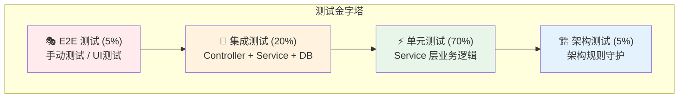
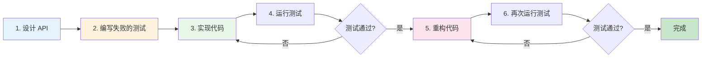

# 测试指南总览

测试是保证代码质量的关键环节。Personal Blog Backend 采用完善的测试体系，确保系统的稳定性和可维护性。

## 🎯 测试哲学

:::tip 核心理念
**测试不是负担，而是保护伞**。良好的测试让你：
- 🔒 **放心重构** - 有测试保护，大胆优化代码
- 🐛 **快速定位** - 测试失败即可精准定位问题
- 📖 **活文档** - 测试即文档，展示代码如何使用
- 🚀 **加速开发** - 长远来看，测试会提高开发效率
:::

## 🛠️ 测试工具箱

项目使用 `spring-boot-starter-test`，已内置业界主流测试工具：

| 工具 | 用途 | 典型场景 |
|------|------|----------|
| **JUnit 5** | 单元测试框架 | 编写测试用例的基础（`@Test`, `@DisplayName`） |
| **Mockito** | 模拟框架 | 模拟依赖的行为，隔离测试对象 |
| **AssertJ** | 流式断言库 | 编写可读性高的断言（`assertThat(...).isEqualTo(...)`） |
| **Spring Test** | 集成测试支持 | 加载 Spring 上下文，测试组件集成 |
| **MockMvc** | Web 层测试 | 模拟 HTTP 请求，测试 Controller |
| **ArchUnit** | 架构测试 | 自动化守护架构规则 |
| **Testcontainers** | 容器化测试 | （可选）在 Docker 中启动真实数据库 |

## 📐 测试金字塔策略

我们遵循**测试金字塔**原则，不同层级的测试关注点不同：



### 为什么是这个比例？

- **单元测试（70%）** - 快速、稳定、易维护
- **集成测试（20%）** - 验证组件协作
- **E2E 测试（5%）** - 验证关键用户流程
- **架构测试（5%）** - 自动化守护设计原则

## ⚡ 单元测试（Unit Tests）

### 测试目标

测试**单个类**（通常是 Service）的业务逻辑。

### 关键特性

- ✅ **不启动 Spring 上下文** - 速度极快（毫秒级）
- ✅ **隔离依赖** - 使用 Mock 隔离所有外部依赖
- ✅ **专注逻辑** - 只测试业务逻辑，不涉及数据库/网络

### 示例代码

```java
@ExtendWith(MockitoExtension.class)
@DisplayName("用户服务单元测试")
class UserServiceImplTest {

    @Mock
    private UserMapper userMapper;

    @Mock
    private RoleMapper roleMapper;

    @Mock
    private UserConverter userConverter;

    @InjectMocks
    private UserServiceImpl userService;

    @Test
    @DisplayName("应该成功注册用户 - 当用户名未被占用时")
    void should_register_user_successfully_when_username_not_taken() {
        // Given - 准备测试数据
        UserDTO userDTO = new UserDTO();
        userDTO.setUsername("testuser");
        userDTO.setPassword("password123");
        userDTO.setEmail("test@example.com");

        User userEntity = new User();
        userEntity.setUsername("testuser");

        given(userMapper.selectByUsername("testuser")).willReturn(null);
        given(userConverter.toEntity(userDTO)).willReturn(userEntity);

        // When - 执行测试
        userService.register(userDTO);

        // Then - 验证结果
        verify(userMapper).insert(any(User.class));
        verify(userMapper, times(1)).selectByUsername("testuser");
    }

    @Test
    @DisplayName("应该抛出异常 - 当用户名已存在时")
    void should_throw_exception_when_username_already_exists() {
        // Given
        UserDTO userDTO = new UserDTO();
        userDTO.setUsername("existinguser");

        User existingUser = new User();
        existingUser.setUsername("existinguser");

        given(userMapper.selectByUsername("existinguser")).willReturn(existingUser);

        // When & Then
        assertThatThrownBy(() -> userService.register(userDTO))
                .isInstanceOf(BusinessException.class)
                .hasMessageContaining("用户名已存在");

        verify(userMapper, never()).insert(any(User.class));
    }
}
```

### 最佳实践

1. **使用 `@ExtendWith(MockitoExtension.class)`** - 启用 Mockito
2. **Mock 所有依赖** - 使用 `@Mock` 注解
3. **使用 Given-When-Then 模式** - 提高可读性
4. **测试边界条件** - null、空字符串、边界值
5. **一个测试一个关注点** - 不要在一个测试中验证多个功能

## 🔗 集成测试（Integration Tests）

### 测试目标

测试**多个组件的协作**（如 Controller + Service + Database）。

### 关键特性

- ✅ **启动 Spring 上下文** - 真实环境
- ✅ **测试完整流程** - 从 HTTP 请求到数据库
- ✅ **验证集成** - 确保组件间正确协作

### 示例代码

```java
@SpringBootTest
@AutoConfigureMockMvc
@DisplayName("用户控制器集成测试")
@Transactional  // 测试后自动回滚数据库
class UserControllerIntegrationTest {

    @Autowired
    private MockMvc mockMvc;

    @Autowired
    private UserMapper userMapper;

    @BeforeEach
    void setUp() {
        // 清理测试数据
        userMapper.delete(null);
    }

    @Test
    @DisplayName("应该返回201 - 当成功注册用户时")
    void should_return_201_when_user_registered_successfully() throws Exception {
        // Given
        String requestBody = """
            {
                "username": "newuser",
                "password": "password123",
                "email": "newuser@example.com"
            }
        """;

        // When & Then
        mockMvc.perform(post("/api/users/register")
                .contentType(MediaType.APPLICATION_JSON)
                .content(requestBody))
                .andExpect(status().isCreated())
                .andExpect(jsonPath("$.code").value(200))
                .andExpect(jsonPath("$.data.username").value("newuser"))
                .andExpect(jsonPath("$.data.email").value("newuser@example.com"))
                .andExpect(jsonPath("$.data.password").doesNotExist());  // 密码不应返回

        // 验证数据库中确实创建了用户
        User savedUser = userMapper.selectByUsername("newuser");
        assertThat(savedUser).isNotNull();
        assertThat(savedUser.getUsername()).isEqualTo("newuser");
    }

    @Test
    @DisplayName("应该返回400 - 当用户名为空时")
    void should_return_400_when_username_is_blank() throws Exception {
        String requestBody = """
            {
                "username": "",
                "password": "password123",
                "email": "test@example.com"
            }
        """;

        mockMvc.perform(post("/api/users/register")
                .contentType(MediaType.APPLICATION_JSON)
                .content(requestBody))
                .andExpect(status().isBadRequest())
                .andExpect(jsonPath("$.code").value(400))
                .andExpect(jsonPath("$.message").value(containsString("用户名")));
    }

    @Test
    @DisplayName("应该返回200 - 当登录成功时")
    void should_return_200_when_login_success() throws Exception {
        // Given - 先创建一个用户
        User user = new User();
        user.setUsername("testuser");
        user.setPasswordHash(passwordEncoder.encode("password123"));
        userMapper.insert(user);

        String requestBody = """
            {
                "username": "testuser",
                "password": "password123"
            }
        """;

        // When & Then
        mockMvc.perform(post("/api/users/login")
                .contentType(MediaType.APPLICATION_JSON)
                .content(requestBody))
                .andExpect(status().isOk())
                .andExpect(jsonPath("$.data.token").exists())
                .andExpect(jsonPath("$.data.token").isString());
    }
}
```

### 最佳实践

1. **使用 `@SpringBootTest`** - 启动完整的 Spring 上下文
2. **使用 `@Transactional`** - 测试后自动回滚，保持数据库干净
3. **使用 `@AutoConfigureMockMvc`** - 自动配置 MockMvc
4. **测试 HTTP 层面** - 验证状态码、响应格式、错误处理
5. **验证数据持久化** - 确保数据真正保存到数据库

## 🏗️ 架构测试（Architecture Tests）

### 测试目标

自动化守护架构红线，防止代码腐化。

### 示例代码

```java
@AnalyzeClasses(packages = "com.blog")
public class ArchitectureTest {

    @ArchTest
    public static final ArchRule controllers_should_be_in_service_module =
        classes()
            .that().resideInAPackage("..controller..")
            .should().resideInAPackage("..service..")
            .because("Controller 必须位于 *-service 模块");

    @ArchTest
    public static final ArchRule service_should_not_depend_on_service =
        noClasses()
            .that().resideInAPackage("..blog.*.service..")
            .should().dependOnClassesThat().resideInAPackage("..blog.*.service..")
            .because("Service 模块不能直接依赖其他 Service 模块");

    @ArchTest
    public static final ArchRule entities_should_not_be_exposed_in_api =
        noClasses()
            .that().resideInAPackage("..entity..")
            .should().dependOnClassesThat().resideInAPackage("..api..")
            .because("Entity 不能暴露到 API 层");
}
```

<!-- ArchUnit 详解文档即将推出 -->

## 📊 测试覆盖率目标

| 层级 | 覆盖率目标 | 说明 |
|------|-----------|------|
| **Service 层** | ≥ 80% | 核心业务逻辑必须充分测试 |
| **Controller 层** | ≥ 70% | 重点测试参数验证和异常处理 |
| **关键路径** | 100% | 认证、权限、支付等核心功能 |

### 查看覆盖率

在 IntelliJ IDEA 中：
1. 右键点击 `src/test/java` 目录
2. 选择 **Run 'Tests' with Coverage**
3. 查看覆盖率报告

## 🔄 推荐的开发流程（TDD）

遵循**测试驱动开发（TDD）**或**测试先行**的思想：



### 详细步骤

1. **设计（Design）** - 定义 DTO 和 Interface
2. **编写测试（Write Tests）** - 先写失败的测试（红）
3. **编码（Coding）** - 实现功能使测试通过（绿）
4. **验证（Verify）** - 运行所有测试
5. **重构（Refactor）** - 在测试保护下优化代码

## ❓ 常见问题

### Q: 每次都要启动数据库吗？

**A:** 
- **单元测试** - 不需要，使用 Mockito 模拟 Mapper
- **集成测试** - 需要数据库，建议使用 H2 内存数据库或 Testcontainers

### Q: Controller 层需要测什么？

**A:** 重点测试：
- 参数校验（`@Valid`）
- HTTP 状态码映射
- 全局异常处理
- 认证和授权

业务逻辑应下沉到 Service 层测试。

### Q: 如何提高测试速度？

**A:**
1. 优先编写单元测试（最快）
2. 使用 `@MockBean` 减少 Bean 加载
3. 使用 `@WebMvcTest` 只加载 Web 层
4. 并行运行测试（JUnit 5 支持）

### Q: 测试数据如何准备？

**A:**
1. **使用 Builder 模式** - 创建测试数据工厂
2. **使用 `@BeforeEach`** - 准备通用测试数据
3. **使用 `@Sql`** - 从 SQL 文件加载数据
4. **避免共享可变状态** - 每个测试独立

## 📚 延伸阅读

<!-- 以下页面即将推出 -->
- **单元测试详解** - 深入单元测试最佳实践
- **集成测试详解** - 集成测试完整指南
- **ArchUnit 详解** - 架构测试实战
- **MockBean 迁移指南** - 从 `@MockBean` 迁移

---

**记住**：测试不是额外的工作，而是开发流程的一部分。良好的测试习惯会让你成为更优秀的开发者！
